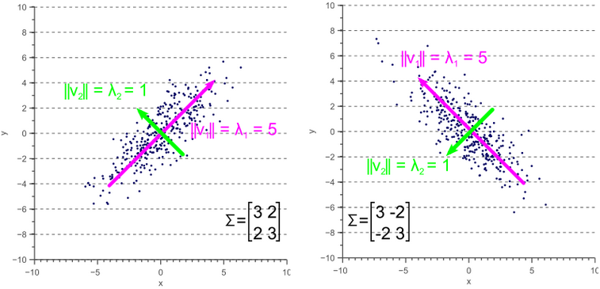

> 3D Gaussian Splatting(3DGS)由2023年论文[3D Gaussian Splatting for Real-Time Radiance Field Rendering](https://arxiv.org/abs/2308.04079)中提出，由于渲染速度快且质量高，迅速超越(NeRF)称为新视角渲染的热点，涌现出大量优秀的后续工作。本篇笔记以论文原文和原作者的[教程](https://3dgstutorial.github.io/3dv_part1.pdf)为基础，包括简单的渲染代码实现，训练时关键参数的初始化等，不包括模型的训练代码。

## Background
如果不了解图形学以及忘记一些基础知识，这里进行简单的介绍。

### Rasterization (删格化)
栅格化（Rasterization）是将矢量图形转换为像素点阵的过程，是计算机图形学中的一个基础概念。简单来说，就是把连续的几何图形（如线段、多边形、曲线等）转换成离散的像素点来显示在屏幕上。Gaussian Splatting在最终显示时仍需要将结果投影到离散像素上，这一步可以看作是一种特殊的栅格化过程。

### Splatting (泼贱)
泼贱是一种渲染技术，形象的说是将3D点或体素"泼洒"到2D图像平面的技术。泼贱技术的关键：
- 核函数：每个3D点或者体素都被视为一个局部影响区域，用一个核函数表示，常见的核函数包括：高斯核，EWA（椭圆加权平均）等
- 投影过程：需要将核函数(包括影响范围和强度)投影到图像平面，而不是简单的投影单个点
- 混合(Blending)：多个点对于同一个像素的贡献要正确的混合，可以按照深度对所有的核函数进行排序

### Multivariate Gaussian Distribution (多元高斯分布)
$N$维随机变量$\mathbf{X}=[x_1, x_2, ..., x_N]$服从多元高斯，记作$\mathbf{X} \sim \mathcal{N}(\mathbf{\mu}, \mathbf{\Sigma})$，则它的概率密度函数为：

$$
\begin{equation}
  p(x) = \frac{1}{(2\pi)^{N/2} |\mathbf{\Sigma}|^{1/2}} \exp\left( -\frac{1}{2} (\mathbf{x} - \mathbf{\mu})^\top \mathbf{\Sigma}^{-1} (\mathbf{x} - \mathbf{\mu}) \right)
\end{equation}
$$

其中：$\mathbf{\mu} \in \mathbb{R}^{N}$是均值向量，$\mathbf{\Sigma} \in \mathbb{R}^{N \times N}$是协方差矩阵，$|\mathbf{\Sigma}|$是协方差矩阵行列式值，$\mathbf{\Sigma}^{-1}$为协方差矩阵的逆。
$(\mathbf{x} - \mathbf{\mu})^\top \mathbf{\Sigma}^{-1} (\mathbf{x} - \mathbf{\mu})$称为马氏距离，用于衡量一个点$\mathbb{x}$与一个分布之间的距离，是一个标量值。
对于多元高斯分布的概率密度函数，它的参数就是$\mathbf{\mu}$和$\mathbf{\Sigma}$，也是3DGS模型的权重。

协方差描述两个随机变量之间的相关性，如果协方差为正，则表示两个变量正相关，即同方向变化，如果为负，则负相关，如果为零，则不相关；协方差值的大小没有比较的意义。协方差矩阵就是多个随机变量协方差构成的方阵。

协方差矩阵是**半正定对称矩阵**，即:

$$
\begin{align}
  \Sigma=\Sigma^\top \rightarrow Cov(x_i, x_j)&=Cov(x_j,x_i) \\
  \mathbf{z}^\top \mathbf{\Sigma} \mathbf{z} \geq 0 ,\quad \forall \mathbf{z} \in \mathbb{R}^N
\end{align}
$$

协方差矩阵的主对角线元素是方差，表示的是分布在特征轴上的离散程度，可以形象的理解是分布的高矮胖瘦；非主对角线元素是协方差，表示的是分布的方向(orientation)或者说旋转。下图[^1]是一个二维多元高斯分布，主对角线元素决定了分布的大小，而非主对角线元素决定了分布的旋转。三维高斯分布是一个椭球。

[^1]: [协方差矩阵的几何解释](https://njuferret.github.io/2019/07/28/2019-07-28_geometric-interpretation-covariance-matrix/)

### Quadratic Form（二次型）
多元高斯分布的定义中使用了二次型，论文中也出现多次二次型形式的矩阵相乘，这里简单介绍。

对于一个对称矩阵$\mathbf{A} \in \mathbb{R}^{N \times N}$和一个**列**向量$\mathbf{z} \in \mathbb{R}^{N}$，二次型的定义如下，二次型的结果为一个**标量**。

$$
Q(\mathbf{z})=\mathbf{z}^\top \mathbf{A} \mathbf{z}
$$

如果见到$\mathbf{z}A\mathbf{z}^\top$，它是什么？有两种可能：1）$\mathbf{z}$是行向量，那么其实和$\mathbf{z}^\top \mathbf{A} \mathbf{z}$是等价的；2）$\mathbf{z}$可能是一个矩阵，那么上面式子只是矩阵相乘了。

### Jacobian Matrix (雅可比矩阵)
假设某**向量值函数** $\mathbf{f}: \mathbb{R}^n \rightarrow \mathbb{R}^m$，即从$\mathbf{x} \in \mathbb{R}^n$映射到向量$\mathbf{f(x)}\in \mathbb{R}^m$，其雅可比矩阵是$m\times n$的矩阵

$$
J = \left[ \frac{\partial f}{\partial x_1} \cdots \frac{\partial f}{\partial x_n} \right] = \left[ \begin{array}{cccc}
\frac{\partial f_1}{\partial x_1} & \cdots & \frac{\partial f_1}{\partial x_n} \\
\vdots & \ddots & \vdots \\
\frac{\partial f_m}{\partial x_1} & \cdots & \frac{\partial f_m}{\partial x_n}
\end{array} \right]
$$

**雅可比矩阵描述了向量值函数在某一点附近的局部线性变换**，通俗的说，雅可比矩阵在某可微点的很小的邻域范围内提供了向量值函数的近似**线性**表示(一阶泰勒展开)，可视化理解几何意义参考[这个视频](https://www.youtube.com/watch?v=bohL918kXQk)。在3D Gaussian投影过程中会遇到这个知识点。

多说一句向量值函数 $\mathbf{f}(\mathbf{x})=(f_1(\mathbf{x}), f_2(\mathbf{x}), ..., f_m(\mathbf{x}))$是输出值为向量的函数，其输入可以是一个标量或者向量。
举一个例子说明，假设有一个粒子在三维空间中运动，其位置随时间$t$变化，我们可以用一个向量值函数来描述这个粒子的位置：
$$\mathbf{r}(t)=\langle f(t), g(t), h(t) \rangle$$
其中，$f(t), g(t), h(t)$分别是例子在$x$轴，$y$轴和$z$轴上的变化。则$\mathbf{r}(t)$是一个向量值函数，输入是时间$t$，输出是三维的例子位置。

## 3D Gaussian Representation

三维空间有很多形式，例如显式的栅格化Voxel，或者隐式的Neural Radiance。3D Gaussian也是一种对三维空间的表征，用大量的3D Gaussians来更自由、更紧凑(相对于稠密、规则的Voxel)的表征三维空间。3D Gaussians的参数 ($\mathbf{\mu}$和$\mathbf{\Sigma}$) 构成了模型的**权重参数**之一，将三维场景的信息(通过训练)“压缩”到的模型参数中去，可以用于新视角生成，也可以有更灵活的用途，甚至是自动驾驶的感知任务[^2]。3D Gaussians的表征也可以使用并行化实现高效的渲染。

[^2]: [GaussianFormer: Scene as Gaussians for Vision-Based 3D Semantic Occupancy Prediction](https://arxiv.org/abs/2405.17429)

具体来说，3D Gaussian表征是一组定义在**世界坐标系下**的参数，包含：三维位置(3D position)，协方差(anisotropic covariance)，不透明度(opacity $\alpha$)和球谐函数(spherical harmonic, SH)：
- 3D位置是三维高斯分布的均值$\mathbf{\mu}$，有3个值
- 协方差是三维高斯分布的$\mathbf{\Sigma}$，可以拆分成主对角线元素3个值和表示三维旋转的四元数4个值，后面会更详细讲解
- 不透明度(opacity $\alpha$)，是一个标量值，用于$\alpha -$blending
- 球谐函数用来表示辐射神经场的带方向的颜色

## The Gaussian Rasterizer
3D Gaussians是定义在世界坐标系下的对三维空间的连续表征，需要进行[栅格化](#rasterization-删格化)渲染到离散空间的图片上。这里涉及到3D Gaussian的投影和渲染。

### 3D Gaussian Splatting
3D Gaussian的位置(均值$\mathbf{\mu}$)正常使用点的投影矩阵即可，但是3D Gaussians是三维空间中的椭球形状如何投影到图像平面，协方差矩阵决定了三维椭球的大小和方向，因此协方差矩阵通过线性/仿射变化投影到图像平面是关键，论文中使用如下公式近似投影协方差矩阵到图像空间：
$$
\Sigma'=JW\Sigma W^{\top}J^{\top}
$$

其中，$W$是世界坐标系到图像平面的投影矩阵，而$J$是投影矩阵的雅可比矩阵。

更实际的公式是下面的公式，
$$
\Sigma_{2D}=JR\Sigma_{3D}R^{\top}J^{\top}
$$
其中，$R$是世界坐标系到图像平面的旋转部分(矩阵)。

> 为什么投影矩阵实际中只有旋转部分没有平移部分？

### $\alpha -$blending

## Optimization

### 3D Gaussian Splatting Pipeline

### Adaptive Control

### 3D Gaussian Initailization

## Tile-based Rasterizer