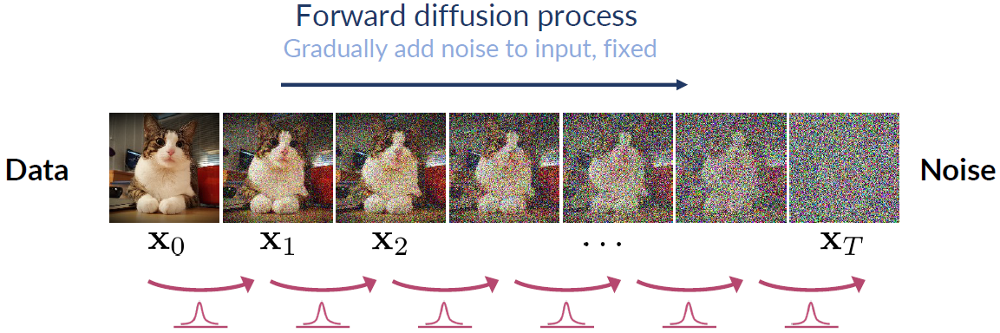

> Diffusion Model（扩散模型）是目前图像、视频生成模型的基础，其核心思想是通过逐步添加噪声（正向扩散）和逐步去噪（反向生成）的过程，将数据从原始分布逐步转换为噪声分布，再通过学习逆过程生成高质量样本。本文是学习扩散模型的笔记。

## Denoising Diffusion Model
Diffusion model早在2015年论文[^1]中提出，但是在2020年[Denoising Diffusion Probabilistic Model](https://arxiv.org/abs/2006.11239)工作中得到广泛认可。扩散模型被人熟知包含正向加噪过程和反向去噪过程。

[^1]: [Deep Unsupervised Learning using Nonequilibrium Thermodynamics](https://arxiv.org/abs/1503.03585)

### Why denoising

**正向过程：把复杂数据“拆解”成简单的噪声**
正向过程的核心任务是逐步向数据中添加噪声，直到它变成完全随机的高斯噪声。这一步看似简单，但它的意义非常深刻。真实世界的数据分布往往是高度复杂的，比如图像、语音、文本，它们的特征空间可能有无数个维度，分布形态也极其不规则。直接建模这样的分布几乎是不可能。但通过正向过程，我们可以把这种复杂性“分解”掉。每一步只添加一点点噪声，逐步掩盖数据的细节，最终让数据完全服从高斯分布，这样一来，原本复杂的分布就被转化成一个简单的高斯分布，学习任务的难度大大降低。这一步的设计，实际上是为了让模型有一个明确的起点和终点，避免在复杂分布中迷失方向。

**反向过程：从噪声中“重建”数据的本质**
反向过程要从完全随机的噪声中逐步还原出原始数据，这一步是整个Diffusion Model的核心，它通过训练神经网络，学习如何在每一步中去除噪声，最终将噪声还原为有意义的数据样本。反向过程并不是简单地“撤销”正向过程，而是通过学习噪声的逆操作，逐步还原数据的本质特征。每一步的去噪操作都相当于在问：“如果我现在有一个带噪声的样本，它最可能的前一步是什么样子？”通过这种方式，模型能够逐步剥离噪声，最终还原出原始数据。这种逐步逼近的方式，不仅让学习任务变得可控，还让模型能够捕捉到数据的深层结构。

这两个过程的存在，实际上是为了应对生成模型中的一个核心难题：**如何在复杂的分布中采样**。生成模型，比如GAN，直接从随机噪声中生成数据，但这种方式容易导致模式崩塌（model collapse），即生成的样本多样性不足。而Denoising Diffusion Model通过正向和反向过程，把生成任务分解成多个小步骤，每一步都只学习一个简单的任务——添加或去除噪声。这种分步学习的方式，不仅提高了模型的稳定性，还显著提升了生成样本的质量和多样性。

### Forward diffusion process
我们令$\mathbf{x_0}$为原始图像，从真实的数据分布$\mathbb{q(x)}$从采样，是正向过程初始时的数据，从$0$到$T$步，逐渐加入噪音，经过足够多的步数，最终$\mathbf{x_T}$为从标准高斯分布中随机采样出来的(噪音)数据，即$\mathbf{x_T} \sim \mathcal{N}(\mathbf{0},\mathbf{I})$。正向过程可以使用下图（来自[^2]）表示:

加噪音的过程定义为Markov过程，即当前步$t$只与上一步$t-1$有关：
$$
q(\mathbf{x}_t \vert \mathbf{x}_{t-1}) = \mathcal{N}(\mathbf{x}_t; \sqrt{1 - \beta_t} \mathbf{x}_{t-1}, \beta_t\mathbf{I}) 
$$
整个前向扩散过程是所有步的联合概率：
$$
q(\mathbf{x}_{1:T} \vert \mathbf{x}_0) = \prod^T_{t=1} q(\mathbf{x}_t \vert \mathbf{x}_{t-1})
$$

前向过程的定义可以得到一个非常优良的性质：可以在任意步$t$使用一个解析解进行采样。我们推导一下，第$t$步和前一步$t-1$的推导关系是：
$$
\begin{align*}
    \mathbf{x_t} = \sqrt{1-\beta_t}\mathbf{x_{t-1}} + \sqrt{\beta_t}\epsilon_{t}
\end{align*}
$$
其中，$\epsilon_t \sim \mathcal{N}(\mathbf{0},\mathbf{I})$

我们试着展开这个递推公式，展开之前，我们先对变量做一些变换，有助于公式的推导，令$\alpha_t=1-\beta_t$：
$$
\begin{align*}
    \mathbf{x_t} &= \sqrt{\alpha_t}\mathbf{x_{t-1}} + \sqrt{1-\alpha_t}\epsilon_{t} \\
    &=\sqrt{\alpha_t}( \sqrt{\alpha_{t-1}}\mathbf{x_{t-2}} + \sqrt{1-\alpha_{t-1}}\epsilon_{t-1}) + \sqrt{1-\alpha_t}\epsilon_{t} \\
    &=\sqrt{\alpha_t\alpha_{t-1}}\mathbf{x_{t-2}} + \underbrace{ \sqrt{\alpha_t(1-\alpha_{t-1})}\epsilon_{t-1} + \sqrt{1-\alpha_t}\epsilon_{t}}_{\text{i.i.d gaussian noise}}
\end{align*}
$$
如果继续展开更多步，噪声项会变得越来越多，因为都是独立同分布的噪声项，由于正态分布是可以叠加的，可以对噪声项进行简化。注意到$\sqrt{\alpha_t(1-\alpha_{t-1})}\epsilon_{t-1} \sim \mathcal{N}(0,\alpha_t(1-\alpha_{t-1})\mathbf{I})$，因为$\epsilon_{t-1} \sim \mathcal{N}(\mathbf{0},\mathbf{I})$，对它进行相乘，不改变均值，但是会改变方差。同理，$\sqrt{1-\alpha_t}\epsilon_{t} \sim \mathcal{N}(0,(1-\alpha_{t})\mathbf{I})$，两个噪声项之和也服从高斯分布，新的分布是$\mathcal{N}(0,\alpha_t(1-\alpha_{t-1})+(1-\alpha_{t})\mathbf{I})=\mathcal{N}(\mathbf{0}, (1-\alpha_t\alpha_{t-1})\mathbf{I})$，两个噪音项的和相当于从新的分布采样，令$\bar{\epsilon}_{t-2}$是合并后从$\mathcal{N}(\mathbf{0},\mathbf{I})$的采样值，再经过缩放：
$$
\sqrt{\alpha_t(1-\alpha_{t-1})}\epsilon_{t-1} + \sqrt{1-\alpha_t}\epsilon_{t}=\sqrt{1-\alpha_t\alpha_{t-1}}\bar{\epsilon}_{t-2}
$$
则，
$$
\begin{align*}
    \mathbf{x_t} &= \sqrt{\alpha_t}\mathbf{x_{t-1}} + \sqrt{1-\alpha_t}\epsilon_{t} \\
    &= \sqrt{\alpha_t\alpha_{t-1}}\mathbf{x_{t-2}} + \sqrt{1-\alpha_t\alpha_{t-1}}\bar{\epsilon}_{t-2}
\end{align*}
$$
我们可以一路推导到$\mathbf{x_0}$：
$$
\begin{aligned}
\mathbf{x}_t 
&= \sqrt{\bar{\alpha}_t}\mathbf{x}_0 + \sqrt{1 - \bar{\alpha}_t}\boldsymbol{\epsilon}
\end{aligned}
$$
其中，$\bar{\alpha}_t=\prod^t_{s=1}\alpha_s$。

这个递推公式等价于从下面的分布进行采样：
$$
q(\mathbf{x}_t \vert \mathbf{x}_0) = \mathcal{N}(\mathbf{x}_t; \sqrt{\bar{\alpha}_t} \mathbf{x}_0, (1 - \bar{\alpha}_t)\mathbf{I})
$$
然后，我们再换回来$\beta_t=1-\alpha_t$:
$$
q(\mathbf{x}_t \vert \mathbf{x}_0) = \mathcal{N}(\mathbf{x}_t; \sqrt{1-\bar{\beta}_t} \mathbf{x}_0, \bar{\beta}_t\mathbf{I})
$$
这样，在任意步$t$都可以进行采样。

最后，还有一些的问题：
- 1.每一步加的噪音为什么不是直接从加和$\epsilon_t$，而是要对$\epsilon_t$使用$\sqrt{\beta_t}$进行缩放？

$\beta_t$是预先定义的标量值，用来控制所加噪声的强度，它不是一个固定值，而是随着步数而变化，如此可以逐步加入噪音。如果直接加入$\epsilon_t$，每一步的噪声都是固定的，这会导致在反向去噪过程中(reverse diffusion process)，难以逐步恢复。

- 2.为什么经过$\mathbf{T}$步骤的逐渐加噪音，$\mathbf{x_T}$最后会服从标准正态分布？

使用中心极限定理可以比较简单的说明。

:::note
中心极限定理（central limit theorem/CLT）是概率论核心定理之一。假设有<code>独立同分布(i.i.d)</code>的随机变量$\mathbf{X_1, X_2,...,X_n}$，总体均值为$\mu$，方差为$\sigma^2$，当样本量$n$足够大的时候，样本均值$\bar{\mathbf{X}}=\frac{1}{n}\sum_{i=1}^{n}\mathbf{X_i}$趋近于标准正态分布
$$
\frac{\bar{\mathbf{X}}-\mu}{\sigma / \sqrt{n}}
\sim
\mathcal{N}(\mathbf{0},\mathbf{I})
$$
:::

[^2]: [SIGGRAPH 2023 Course on Diffusion Models](https://dl.acm.org/doi/10.1145/3587423.3595503)

### Reverse diffusion process

