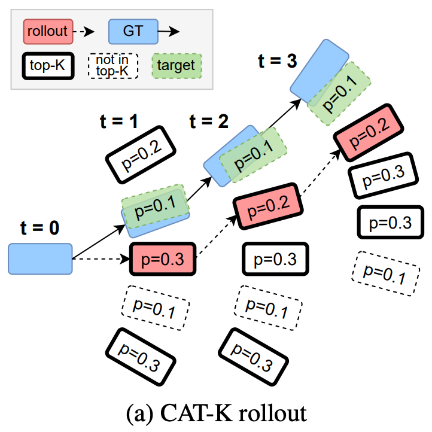

> 持续记录端到端自动驾驶的论文和认识。

## Insights
- [2025.07]业界的一阶段端到端方法已经开始使用超大量计算进行轨迹的预测任务了，包括可能10万小时以上的数据和千卡以上 GPU进行模仿学习的训练，证明Scaling Law在端到端预测轨迹的任务上依旧有效。根据语言模型的发展，强化学习的微调一定会是下一步的重点！
- [2025.06]Waymo的论文Scaling Laws of Motion Forecasting and Planning[^3]中使用了非常惊人的5000000小时的数据进行了IL的训练，远远超过开源数据集的训练量，模型的能力持续提升。IL中的OOD问题，是不是因为训练数据的投入远远不够？像LLM范式中的**Heavy** IL + RL finetune是否能在AI Planning中同样成功？
- [2025.03]当前绝大部分的E2E AD都采用了模仿学习(Imitation Learning, IL)，即使用大量的人类驾驶数据为监督学习驾驶行为，使用IL学习需要闭环反馈的驾驶行为存在很多问题。比较少数使用Model Based IL来同时学习World Model和Driving Policy[^1]。采用IL的模型普遍会遇到比较严重的泛化问题。
- Wang Naiyan在知乎回答 [^2] 中对IL E2E问题的分析 
    <details>
    <summary>主要存在两个问题：Out of Distribution (OOD)和Sparse Supervision：</summary>

    1. Out of Distribution (OOD)：这个问题很早就熟悉，即驾驶策略的泛化性问题：“由于时序的累计，误差由于修正不及时可能会导致最后巨大的偏差，也就是会让系统进入到一个训练数据中不常见的state，也就是所谓的compounding error问题”。
    
        为了缓解这个问题，一个直观的做法是对数据做augmentation，这也是目前端到端方法训练中常用的trick。但是这不能从根本上解决这样的问题，理论完善的方法，类似于DAgger这种需要在线access expert的方法在自动驾驶场景中又无法低成本实现。更为重要的是，由于$p(a \vert s)$的高度多峰性，为了能学习到，数据采集中不仅仅要覆盖到罕见的state，还要覆盖到这样state下的每一个峰值，这使得本来就很难的采集变得雪上加霜。
        
        一个常见的办法是**结合RL和IL**，也就是说会设计一些reward或者cost，让系统在这样的情况下回归到in distribution的状态。

    2. Sparse Supervision: 可以区分IL和RL的奖励稀疏问题。IL中："监督稀疏性主要来源于问题本身是一个非常高维到低维的映射，然后监督信息的信息量明显不足，即只提供一个正样本作为监督。在端到端自动驾驶中，输入往往是一个多帧多视角的视频序列，输出只有一条轨迹（往往使用一个十几维的参数化形式）。这使得数据利用效率非常之低。"
        
        在RL中：“稀疏监督的问题在于，虽然我们可以设计种类繁多的reward，但是reward往往只会在terminal state上给出，我们需要漫长的propagation的过程，才能使这样监督信息传递到其他的state中去。这个问题被讨论的非常多，就不再赘述。比如，在自动驾驶中，我们往往会根据horizon内轨迹的碰撞设计cost，但是我们希望的驾驶行为是在进入到这样的危险状况之前，就采取防御性驾驶行为规避进入到这样状态的可能性。”

        如何把稀疏的奖励信号变得Dense？
       - “一个常见的思路是针对任务手工设计dense reward”。但是这个思路其实很难。
       - 另外一个思路是通过大模型将世界常识注入到IL中，来解释为什么expert会采用这样的一个action。也就是通过大模型将demonstration拆解并提供更多的监督。”
    </details>

[^1]: [Model-based imitation learning for urban driving](https://arxiv.org/abs/2210.07729)
[^2]: [Imitation Learning or not?](https://zhuanlan.zhihu.com/p/721582016?utm_id=0)
[^3]: [Scaling Laws of Motion Forecasting and Planning](https://arxiv.org/pdf/2506.08228)

## Lit Review

- [Trajeglish: Traffic Modeling as Next-Token Prediction](https://arxiv.org/abs/2312.04535)
  - TL;DR: Trajeglish对所有Agent运动状态的**相对位姿转移**进行聚类得到了Motion Vocabulary，这样轨迹就可以离散为一些列Token的序列。Motion Vocabulary成为后续工作SMART的离散化方法。
  - 聚类的方法称为k-disks，这是一种逐步(随机)选择中心点，求中心点邻域内均值作为代表性中心点，再剔除掉中心点领域内的所有点，再剩余的所有点中随机选择中心点，然后重复直到选择出N个聚类中心点的方法。
    - 为什么它能选择出来有代表性的中心点呢？尤其是后面是随机选择中心点。随机选择选中密集区域的概率远高于稀疏的区域，虽然确实有可能有一些离群中心点，但是绝大部分的中心点都是密集区域，并且通过取mean会获得有代表性的中心点。
    - 代码如下：
      ```python
      def Kdisk_cluster(
          X,  # [n_trajs, 4, 2], bbox of the last point of the segment which is a_pos
          N,  # int
          tol = 0.05,  # 0.05m
          a_pos,  # [n_trajs, 6, 3], the complete segment
      ):
          n_total = X.shape[0]
          ret_traj_list = []

          for i in range(N):
              if i == 0:
                  choice_index = 0  # always include [0, 0, 0]
              else:
                  choice_index = torch.randint(0, X.shape[0], (1,)).item()
              x0 = X[choice_index]
              # res_mask = torch.sum((X - x0) ** 2, dim=[1, 2]) / 4.0 > (tol**2)
              res_mask = torch.norm(X - x0, dim=-1).mean(-1) > tol
              ret_traj = a_pos[~res_mask].mean(0, keepdim=True)

              X = X[res_mask]
              a_pos = a_pos[res_mask]
              ret_traj_list.append(ret_traj)

              remain = X.shape[0] * 100.0 / n_total
              n_inside = (~res_mask).sum().item()
              print(f"{i=}, {remain=:.2f}%, {n_inside=}")

          return torch.cat(ret_traj_list, dim=0)  # [N, 6, 3]
      ```
- [MotionLM: Multi-Agent Motion Forecasting as Language Modeling](https://arxiv.org/abs/2309.16534)
  - TL;DR: MotionLM同样是使用NTP来构建所有Agent的运动，它采用的是x和y轴均匀的离散化方法。
- [SMART: Scalable Multi-agent Real-time Simulation via Next-token Prediction](https://arxiv.org/abs/2405.15677)
    - tl;dr SMART对交通的所有要素进行了离散化，包括所有Agents的状态、地图的所有多段线(Polyline)，以及我们要预测的所有Agent的轨迹，轨迹离散化采用的时Trajeglish的方式，0.5s的轨迹点。
      - SMART论文中的网络结构示意图时Transformer Decoder，但是代码实现上采用的时图网络(PyG)，构建了Agent时序，Agent和Map，Agent和Agent的时空Graph，然后巧妙将Transformer的基本操作全部嵌入其中。
- [Closed-Loop Supervised Fine-Tuning of Tokenized Traffic Models](https://arxiv.org/abs/2412.05334)
  - CAT-K基于SMART进行了所谓的“闭环有监督微调”，(我认为)主要针对的是在Covariance Shift的问题，即Policy在进行序列预测时，会随着时间和误差的累计逐渐越错越大，所以也叫CAT-K Rollout。
  - SMART的Next token prediction训练如果从预测轨迹序列角度来看，可以看作是Teacher Forcing，即给定真值进行预测，而不是自回归预测，模型因此无法从错误的预测中恢复。
  - CAT-K Rollout在进行序列预测时，会使用先选择Top K个候选，再选择Top-K中距离真值最近的那一个：
    - 红色是CAT-K Rollout的轨迹，虽然有绿色的候选，但是绿色并不在概率Top K之内，因此选择红色；但是，重要的是**绿色是我们预测的真值**
    - 
  - CAT-K训练实现：
    - 使用Top-K和Distance进行采样：首先根据logits大小采样Top-K个，再将其赋值成与真值的距离，最后根据距离进行采样(`samples = Categorical(logits=topk_logits).sample()`)，代码参见[`sample_next_token_traj`](https://github.com/NVlabs/catk/blob/d23886761fc5b5628c5973148c40284452745745/src/smart/utils/rollout.py#L105C5-L105C27)。注意这里的采样保持着一定的探索性，虽然采样函数会返回`next_token_idx`，但是它是没有用处的，这个`token_idx`是上图中的红色框，而我们真正需要的是绿色的框！
    - 如何找到绿色框，即CAT-K Rollout的**Token Index**真值？代码见：[`get_euclidean_targets`](https://github.com/NVlabs/catk/blob/d23886761fc5b5628c5973148c40284452745745/src/smart/metrics/utils.py#L50)
      - 上图举例来说，例如要寻找`t=2`时刻的Token Index，我们需要退回到`t=1`时刻的Rollout的红色框，计算它与`t=2`时刻蓝色真值框的$\Delta x, \Delta y, \Delta \theta$，从Motion Vocab中寻找最近的Token。如此再每次Rollout时候，到达一个新的状态，我都知道哪个动作Token是可以会到GT轨迹的，即可以一定程度上解决Covariance Shift的问题。