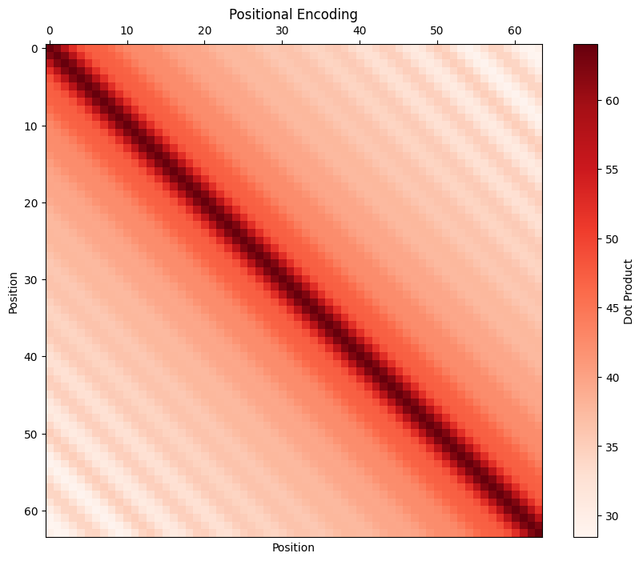

> Position Encoding是[Transformer](https://www.s7ev3n.space/posts/transformer/)重要组成部分，输入序列通过加入对输入位置编码后的信息，使模型有能力分辨不同位置的能力，主要有**绝对位置编码**和**相对位置编码**。本文是对苏神的[Transformer升级之路系列](https://spaces.ac.cn/archives/8231)[^1][^3]的个人笔记以及RoPE编码[^2]的学习。

[^1]: [Transformer升级之路1](https://spaces.ac.cn/archives/8231)
[^2]: [Transformer升级之路2](https://kexue.fm/archives/8265)
[^3]: [让研究人员绞尽脑汁的Transformer位置编码](https://kexue.fm/archives/8130)
[^4]: [层次分解位置编码，让BERT可以处理超长文本](https://kexue.fm/archives/7947)

## Sinusoidal PE in the details
位置编码在Transformer原文中的戏份并不多，主要目的是由于自注意力attention的操作是不区分位置的，因此我们需要让模型知道，例如这是第几个词（绝对位置），这个词和另一个词的距离（相对位置）。

虽然知道三角函数位置编码的具体公式和代码，但是很多细节和设计理由并没有深究，比较简单的两个问题是：
- **位置编码是如何给输入序列注入位置信息的？**
- **为什么相加就赋予了输入Embedding序列位置信息了？**

### Unique Position Encoding
回顾一下三角函数位置编码：
$$
\begin{equation}\left\{\begin{aligned}\boldsymbol{p}_{k,2i}&=\sin\Big(k/10000^{2i/d}\Big)\\ 
\boldsymbol{p}_{k, 2i+1}&=\cos\Big(k/10000^{2i/d}\Big) 
\end{aligned}\right.\end{equation}
$$
其中，$p_{k,2i},p_{k,2i+1}$分别是序列中位置$k$处的、在`embed_dim`上的$2i,2i+1$的位置，$d$是`embed_dim`的大小。

换一种形式可以看到，每个对序列$k$位置的位置编码向量$\boldsymbol{p}_{k}$每个值在奇偶位是$\sin$和$\cos$交替变换:
$$
\begin{equation}
\boldsymbol{p}_{k} = \begin{bmatrix} 
\sin({\omega_0} \cdot k)\\ 
\cos({\omega_0} \cdot k)\\ 
\\
\sin({\omega_1} \cdot k)\\ 
\cos({\omega_1} \cdot k)\\ 
\\
\vdots\\ 
\\
\sin({\omega_{\frac{d}{2}-1}} \cdot k)\\ 
\cos({\omega_{\frac{d}{2}-1}} \cdot k) 
\end{bmatrix}
\end{equation}
$$
其中，$\omega_i = \frac{1}{10000^{2i / d}}$，请记住这里**奇数和偶数位分别是频率相同的$\sin$和$\cos$组成的一对**，后面的RoPE会使用这一个二维向量举例。

> **为什么上式赋予了Embedding位置信息？**

我们先回到问题的原点，如果想要给某个序列添加位置信息，这个位置信息是什么样子的呢？
有一些选项：
- 例如$[0,1]$区间分别代表序列中第一个位置和最后一个位置，但是缺点是如果序列长度变化，不能保证，每个绝对位置上的值不变
- 或者，可以把位置这个数字直接给到序列，即$1,2,...,n$，但是缺点是序列的位置会变得很大，如果序列非常长的话

总结起来，给序列提供位置信息需要的性质：
- 每个序列位置的位置编码应该是唯一的
- 必须是确定性的，是序列位置$k$的确定性函数，不能对不同的序列长度，位置编码是不同的

:::important
**给每个序列中的位置提供唯一的位置编码信息，如此就为输入序列注入了位置信息。**
:::

很多文章使用二进制的数字来表示整型的位置[^5]举例对三角函数编码交替进行比较，例如:
$$
\begin{align}
  0: \ \ \ \ \color{orange}{\texttt{0}} \ \ \color{green}{\texttt{0}} \ \ \color{blue}{\texttt{0}} \ \ \color{red}{\texttt{0}} & & 
  8: \ \ \ \ \color{orange}{\texttt{1}} \ \ \color{green}{\texttt{0}} \ \ \color{blue}{\texttt{0}} \ \ \color{red}{\texttt{0}} \\
  1: \ \ \ \ \color{orange}{\texttt{0}} \ \ \color{green}{\texttt{0}} \ \ \color{blue}{\texttt{0}} \ \ \color{red}{\texttt{1}} & & 
  9: \ \ \ \ \color{orange}{\texttt{1}} \ \ \color{green}{\texttt{0}} \ \ \color{blue}{\texttt{0}} \ \ \color{red}{\texttt{1}} \\ 
  2: \ \ \ \ \color{orange}{\texttt{0}} \ \ \color{green}{\texttt{0}} \ \ \color{blue}{\texttt{1}} \ \ \color{red}{\texttt{0}} & & 
  10: \ \ \ \ \color{orange}{\texttt{1}} \ \ \color{green}{\texttt{0}} \ \ \color{blue}{\texttt{1}} \ \ \color{red}{\texttt{0}} \\ 
  3: \ \ \ \ \color{orange}{\texttt{0}} \ \ \color{green}{\texttt{0}} \ \ \color{blue}{\texttt{1}} \ \ \color{red}{\texttt{1}} & & 
  11: \ \ \ \ \color{orange}{\texttt{1}} \ \ \color{green}{\texttt{0}} \ \ \color{blue}{\texttt{1}} \ \ \color{red}{\texttt{1}} \\ 
  4: \ \ \ \ \color{orange}{\texttt{0}} \ \ \color{green}{\texttt{1}} \ \ \color{blue}{\texttt{0}} \ \ \color{red}{\texttt{0}} & & 
  12: \ \ \ \ \color{orange}{\texttt{1}} \ \ \color{green}{\texttt{1}} \ \ \color{blue}{\texttt{0}} \ \ \color{red}{\texttt{0}} \\
  5: \ \ \ \ \color{orange}{\texttt{0}} \ \ \color{green}{\texttt{1}} \ \ \color{blue}{\texttt{0}} \ \ \color{red}{\texttt{1}} & & 
  13: \ \ \ \ \color{orange}{\texttt{1}} \ \ \color{green}{\texttt{1}} \ \ \color{blue}{\texttt{0}} \ \ \color{red}{\texttt{1}} \\
  6: \ \ \ \ \color{orange}{\texttt{0}} \ \ \color{green}{\texttt{1}} \ \ \color{blue}{\texttt{1}} \ \ \color{red}{\texttt{0}} & & 
  14: \ \ \ \ \color{orange}{\texttt{1}} \ \ \color{green}{\texttt{1}} \ \ \color{blue}{\texttt{1}} \ \ \color{red}{\texttt{0}} \\
  7: \ \ \ \ \color{orange}{\texttt{0}} \ \ \color{green}{\texttt{1}} \ \ \color{blue}{\texttt{1}} \ \ \color{red}{\texttt{1}} & & 
  15: \ \ \ \ \color{orange}{\texttt{1}} \ \ \color{green}{\texttt{1}} \ \ \color{blue}{\texttt{1}} \ \ \color{red}{\texttt{1}} \\
\end{align} 
$$
可以观察到：低位(红色)的0和1交替是非常快速的，越往高位走，0和1的交替频率会越低。0和1的交替都是整型，它的浮点数形式就想到了三角函数交替了。

[^5]: [Transformer Architecture: The Positional Encoding](https://kazemnejad.com/blog/transformer_architecture_positional_encoding/)

### Why Addtion
第二个问题：为什么和输入Embedding序列相加？Concat行不行?

**tl;dr是其实concat应该也没有太大的问题，但是可能会增加一些参数量。**

Reddit上有一个不错的回答[^6]:

In attention, we basically take two word embeddings (x and y), pass one through a Query transformation matrix (Q) and the second through a Key transformation matrix (K), and compare how similar the resulting query and key vectors are by their dot product. So, basically, we want the dot product between Qx and Ky, which we write as:

(Qx)'(Ky) = x' (Q'Ky). So equivalently we just need to learn one joint Query-Key transformation (Q'K) that transform the secondary inputs y into a new space in which we can compare x.

By adding positional encodings e and f to x and y, respectively, we essentially change the dot product to

(Q(x+e))' (K(y+f)) = (Qx+Qe)' (Ky+Kf) = (Qx)' Ky + (Qx)' Kf + (Qe)' Ky + (Qe)' Kf = x' (Q'Ky) + x' (Q'Kf) + e' (Q'Ky) + e' (Q'K f), where in addition to the original x' (Q'Ky) term, which asks the question "how much attention should we pay to word x given word y", we also have x' (Q'Kf) + e' (Q'Ky) + e' (Q'K f), which ask the additional questions, "how much attention should we pay to word x given the position f of word y", "how much attention should we pay to y given the position e of word x", and "how much attention should we pay to the position e of word x given the position f of word y".

Essentially, the learned transformation matrix Q'K with positional encodings has to do all four of these tasks simultaneously. This is the part that may appear inefficient, since intuitively, there should be a trade-off in the ability of Q'K to do four tasks simultaneously and well.

HOWEVER, MY GUESS is that there isn't actually a trade-off when we force Q'K to do all four of these tasks, because of some approximate orthogonality condition that is satisfied of in high dimensions. The intuition for this is that randomly chosen vectors in high dimensions are almost always approximately orthogonal. There's no reason to think that the word vectors and position encoding vectors are related in any way. If the word embeddings form a smaller dimensional subspace and the positional encodings form another smaller dimensional subspace, then perhaps the two subspaces themselves are approximately orthogonal, so presumably these subspaces can be transformed approx. independently through the same learned Q'K transformation (since they basically exist on different axes in high dimensional space). I don't know if this is true, but it seems intuitively possible.

If true, this would explain why adding positional encodings, instead of concatenation, is essentially fine. Concatenation would ensure that the positional dimensions are orthogonal to the word dimensions, but my guess is that, because these embedding spaces are so high dimensional, you can get approximate orthogonality for free even when adding, without the costs of concatenation (many more parameters to learn). Adding layers would only help with this, by allowing for nonlinearities.

We also ultimately want e and f to behave in some nice ways, so that there's some kind of "closeness" in the vector representation with respect to small changes in positions. The sin and cos representation is nice since nearby positions have high similarity in their positional encodings, which may make it easier to learn transformations that "preserve" this desired closeness.

(Maybe I'm wrong, and the approximate orthogonality arises from stacking multiple layers or non-linearities in the fully-connected parts of the transformer).

tl;dr: It is intuitively possible that, in high dimensions, the word vectors form a smaller dimensional subspace within the full embedding space, and the positional vectors form a different smaller dimensional subspace approximately orthogonal to the one spanned by word vectors. Thus despite vector addition, the two subspaces can be manipulated essentially independently of each other by some single learned transformation. Thus, concatenation doesn't add much, but greatly increases cost in terms of parameters to learn.

[^6]: [Positional Encoding in Transformer](https://www.reddit.com/r/MachineLearning/comments/cttefo/comment/exs7d08/)

### Relative Position
> Transformer原文中有一句话：“We chose this function because we hypothesized it would allow the model to easily learn to attend by relative positions, since for any fixed offset $\Delta d$, $\boldsymbol{p}_{k+\Delta d}$ can be represented as a linear function of $\boldsymbol{p}_{k}$." 也就是说三角函数位置编码支持表达**相对位置**。

翻译一下上面的表达到公式是说存在一个只与相对位置有关的$\boldsymbol{T}^{(\Delta d)}$：
$$
\boldsymbol{T}^{(\Delta d)}\boldsymbol{p}_{k,:}=\boldsymbol{p}_{k+\Delta d,:}
$$

文章[^7]做了详细的推导，

$$
\boldsymbol{T}^{(\Delta d)} = \begin{bmatrix}
\boldsymbol{\Phi}^{(\Delta d)}_0 & \boldsymbol{0} & \cdots & \boldsymbol{0} \\
\boldsymbol{0} & \boldsymbol{\Phi}^{(\Delta d)}_1 & \cdots & \boldsymbol{0} \\
\boldsymbol{0} & \boldsymbol{0} & \ddots & \boldsymbol{0} \\
\boldsymbol{0} & \boldsymbol{0} & \cdots & \boldsymbol{\Phi}^{(\Delta d)}_{\frac{d}{2}-1}
\end{bmatrix}
$$
其中，$\boldsymbol{0}$表示的是$2 \times 2$的全$0$矩阵，$\boldsymbol{\Phi}^{(\Delta d)}_m$与每个三角函数对相乘:
$$
\boldsymbol{\Phi}^{(\Delta d)}_m \cdot
\begin{bmatrix} 
\sin({\omega_m} \cdot k)\\ 
\cos({\omega_m} \cdot k)
\end{bmatrix} = 
\begin{bmatrix} 
\sin({\omega_m} \cdot (k+\Delta d))\\ 
\cos({\omega_m} \cdot (k+\Delta d))
\end{bmatrix}
$$

求得：
$$
\boldsymbol{\Phi}^{(\Delta d)}_m = 
\begin{bmatrix} 
\cos({\omega_m} \cdot \Delta d) && \sin({\omega_m} \cdot \Delta d) \\ 
-\sin({\omega_m} \cdot \Delta d) && \cos({\omega_m} \cdot \Delta d)
\end{bmatrix}
$$

可以看到，$\boldsymbol{\Phi}^{(\Delta d)}_m$和序列绝对位置$k$完全不相关，而只与相对距离$\Delta d$有关。

这意味着加入到Embedding序列中的位置编码$\boldsymbol{p}_{m}$和$\boldsymbol{p}_{n}$在进行注意力(内积)计算时，$\boldsymbol{p}_{m}\boldsymbol{p}_{n}^{\top}=\boldsymbol{T}^{(n-m)}\boldsymbol{p}_{n}\boldsymbol{p}_{n}^{\top}$，即模型$Q_k$只需要学习和两个位置之间距离有关的线性变换即可，赋予模型识别序列中相对位置的能力。

[^7]: [Linear Relationships in the Transformer’s Positional Encoding](https://blog.timodenk.com/linear-relationships-in-the-transformers-positional-encoding/)

### 远程衰减
三角函数位置编码的深度解读[^1]中有一个章节叫远程衰减，和三角函数编码的相对性有过公式推导级别的讨论一个优良的性质：位置编码的内积值，随着相对距离的增大逐渐趋近于$0$，这符合直觉：相对距离越大的输入，其位置相关性越弱。如果推导公式比较难，可以可视化三角函数位置编码的内积，得到类似confusion matrix的可视化矩阵：

## Absolute and Relative PE
### 绝对位置编码
一般来说，绝对位置编码会加到输入序列中：在输入的第$k$个向量$x_k$中加入位置向量$p_k$，即$x_k+p_k$，其中$p_k$只依赖于在序列的位置$k$。
常见的位置向量形式是三角式(Sinusoidal)和可训练式，也有其他形式[^3]。

相对于相对位置编码，绝对位置编码的优点是计算复杂度更低。

#### 三角函数(Sinusoidal)

在[Transformer](https://www.s7ev3n.space/posts/transformer/)文中，我们知道Sinusocidal位置编码在`embed_sim`后面接近于$0$和$1$间隔的编码，因此可以期望它有一定的**外推性**。

三角函数还有一个有意思的性质：$\sin(i+j)=\sin i\cos j+\cos i\sin j$和$\cos(i+j)=\cos i \cos j - \sin i \sin j$，即位置$i+j$可以表示成$i$和$j$的组合的形式，这提供了某种表达相对位置编码的性质。

:::important
**外推性**是指模型在推理阶段输入比训练阶段更长序列时的泛化能力。举例来说，预训练时的最大长度是$512$，但是在推理时输入了$768$长度的序列，由于位置编码在训练时没有见过这样长的序列，位置编码是否还可以提供有效的位置信息。
:::

#### 可训练式
可训练式位置编码不去设计编码的形式，而是将编码作为可学习的参数，与输入向量相加。在视觉任务的Transformer工作中，例如DETR及其后续工作，都是位置编码都是可训练式。

不难想象，可训练式位置编码的缺点是没有外推性，即推理时无法处理超过训练时最长长度的输入序列。不过，苏神的文章[^4]通过层次分解的方式，使得绝对位置编码能外推到足够的长度。

### 相对位置编码
相对位置并没有完整建模每个输入的位置信息，而是在计算attention的时候考虑当前位置与其他位置的相对距离，由于自然语言一般更依赖于相对位置，所以**相对位置编码通常有着优秀的表现**。对于相对位置编码来说，它的灵活性更大。但是，由于相对位置编码对Attention的计算进行了修改，它的计算复杂度和attention计算同样是$O(n^2)$，效率上显然低于绝对位置编码。另外，还是由于修改了Attention计算，后面对Attention的优化工作就无法执行。总的来说，相对和绝对位置编码是一个trade-off，而后面将要介绍的RoPE编码是融合了相对位置和绝对位置的一种编码方式，成为LLM的标配。

考虑一般形式的相对位置编码[^5]:
$$
\begin{equation}\left\{\begin{aligned} 
\boldsymbol{q}_i =&\, (\boldsymbol{x}_i + \boldsymbol{p}_i)\boldsymbol{W}_Q \\ 
\boldsymbol{k}_j =&\, (\boldsymbol{x}_j + \boldsymbol{p}_j)\boldsymbol{W}_K \\ 
\boldsymbol{v}_j =&\, (\boldsymbol{x}_j + \boldsymbol{p}_j)\boldsymbol{W}_V \\ 
a_{i,j} =&\, softmax\left(\boldsymbol{q}_i \boldsymbol{k}_j^{\top}\right)\\ 
\boldsymbol{o}_i =&\, \sum_j a_{i,j}\boldsymbol{v}_j 
\end{aligned}\right.\end{equation}
$$
其中$i$和$j$对应序列中的不同位置。

我们将$q_i$和$k_j$代入到$softmax$的公式的$q_i k_j^\top$中去，得到：
$$
\begin{equation} 
\boldsymbol{q}_i \boldsymbol{k}_j^{\top} = \left(\boldsymbol{x}_i + \boldsymbol{p}_i\right)\boldsymbol{W}_Q \boldsymbol{W}_K^{\top}\left(\boldsymbol{x}_j + \boldsymbol{p}_j\right)^{\top} = \left(\boldsymbol{x}_i \boldsymbol{W}_Q + \boldsymbol{p}_i \boldsymbol{W}_Q\right)\left(\boldsymbol{W}_K^{\top}\boldsymbol{x}_j^{\top} + \boldsymbol{W}_K^{\top}\boldsymbol{p}_j^{\top}\right) 
\end{equation}
$$
作为对比，假如我们没有相对位置编码的偏置，应该是：
$$
\boldsymbol{q}_i \boldsymbol{k}_j^{\top}=\boldsymbol{x}_i \boldsymbol{W}_Q \boldsymbol{W}_K^{\top} \boldsymbol{x}_j^{\top}
$$
那么，去掉$\boldsymbol{p}_i \boldsymbol{W}_Q$，并且将$\boldsymbol{p}_j \boldsymbol{W}_K$替换成$\boldsymbol{R}_{i,j}^{K}$:
$$
\begin{equation} 
a_{i,j} = softmax\left(\boldsymbol{x}_i \boldsymbol{W}_Q\left(\boldsymbol{x}_j\boldsymbol{W}_K + \color{green}{\boldsymbol{R}_{i,j}^K}\right)^{\top}\right) 
\end{equation}
$$
最后，在使用$v_i$计算加权和时:$\boldsymbol{o}_i =\sum\limits_j a_{i,j}\boldsymbol{v}_j = \sum\limits_j a_{i,j}(\boldsymbol{x}_j\boldsymbol{W}_V + \boldsymbol{p}_j\boldsymbol{W}_V)$，将$\boldsymbol{p}_j\boldsymbol{W}_V$替换成$\boldsymbol{R}_{i,j}^{V}$:
$$
\begin{equation}
\boldsymbol{o}_i = \sum_j a_{i,j}\left(\boldsymbol{x}_j\boldsymbol{W}_V + \color{green}{\boldsymbol{R}_{i,j}^{V}}\right) 
\end{equation}
$$
那么，$\boldsymbol{R}_{i,j}^{K}$和$\boldsymbol{R}_{i,j}^{V}$是什么？它们怎么体现出相对的位置关系的？
所谓相对位置，是"将本来依赖于二元坐标$(i,j)$的向量$\boldsymbol{R}_{i,j}^{K}, \boldsymbol{R}_{i,j}^{V}$，改为只依赖于相对距离$i−j$，并且通常来说会进行截断，以适应不同任意的距离":
$$
\begin{equation}\begin{aligned} 
\boldsymbol{R}_{i,j}^{K} = \boldsymbol{p}_K\left[\text{clip}(i-j, p_{\min}, p_{\max})\right] \\ 
\boldsymbol{R}_{i,j}^{V} = \boldsymbol{p}_V\left[\text{clip}(i-j, p_{\min}, p_{\max})\right]
\end{aligned}\end{equation}
$$
$\boldsymbol{p}_K$和$\boldsymbol{p}_V$是**可以是可训练式活三角函数式**的，都可以达到处理任意长度文本的需求。

相对位置编码还有一些形式，例如XLNET，T5或DeBERTa，都是对上面的一般式进行了一些变化[^3]。

[^5]: [Self-Attention with Relative Position Representations](https://arxiv.org/abs/1803.02155)
## 旋转式位置编码
"一般来说，绝对位置编码具有实现简单、计算速度快等优点，而相对位置编码则直接地体现了相对位置信号，跟我们的直观理解吻合，实际性能往往也更好。由此可见，如果可以通过绝对位置编码的方式实现相对位置编码，那么就是集各家之所长。"

旋转式位置编码，英文是Rotary Position Embedding (RoPE) 是一种“绝对位置编码的方式实现相对位置编码”的设计[^2]，简单说来RoPE利用向量的内积的复数形式，使得绝对位置编码的方式中内含对相对位置的依赖。

:::note
将向量表示为复数形式时，通常使用极坐标的形式$re^{i\theta}$，其中$r$是向量的模，$\theta$是向量与$x$轴正方向的夹脚，
:::
