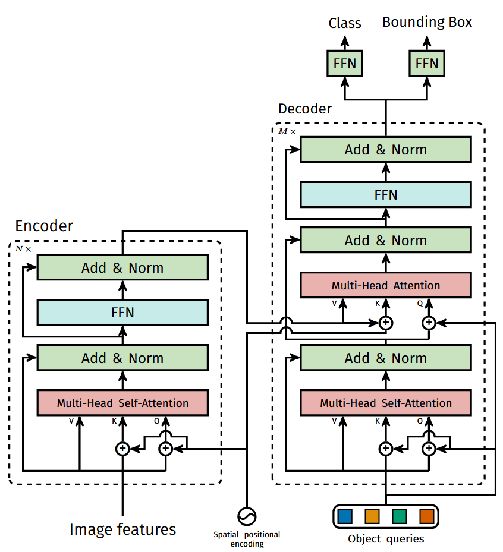
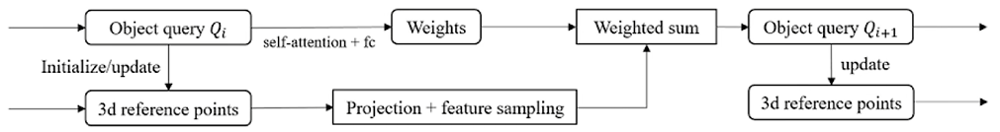

> 视觉三维目标检测在纯视觉自动驾驶扮演着重要的角色，其检测精度逐年提高，在海量数据的训练，精度已经可以和激光雷达相似。技术上，经历了“图像-> 伪点云 -> BEV -> Query-based”。这篇主要梳理当前主流的基于Query的稀疏目标检测方法。

## DETR
DETR开启了基于Transformer检测器的新时代，其重要意义是：去掉NMS真正做到了端到端的目标检测。得益于Transformer的灵活性和对海量数据的表达能力，后续工作极大的提升了目标检测的性能。

DETR的模型结构很简洁，见下图，DETR模型的重点在Decoder部分，Encoder部分使用ViT或者CNN提取特征并不重要。

### DETR的改进

## DETR3D
DETR3D是DETR使用在3D目标检测的开篇工作。简单来说：
- 使用一组object query来预测一组三维参考点(目标框中心点)：$c_{li}=\Phi^{ref}(\mathbf{q}_{li}) \in \mathbb{R^3}$
- 参考点投影到图像的像素位置：$c_{lmi}=P\cdot c_{li}$
- 根据参考点像素从多尺度的图像特征中采样：$\mathbf{f}_{lkmi}=f^{bilinear}(F_{img, c_{lmi}}) \rightarrow f_{li}=\sum_{k}\sum_{m}\mathbf{f}_{lkmi}$
- 和object query进行融合：$\mathbf{q}_{(l+1)i}=\mathbb{f}_{li}+\mathbf{q}_{li}$
- 得到的object query在下一层中进行self attention

可以用下面的逻辑图更好的理解DETR3D的过程：
