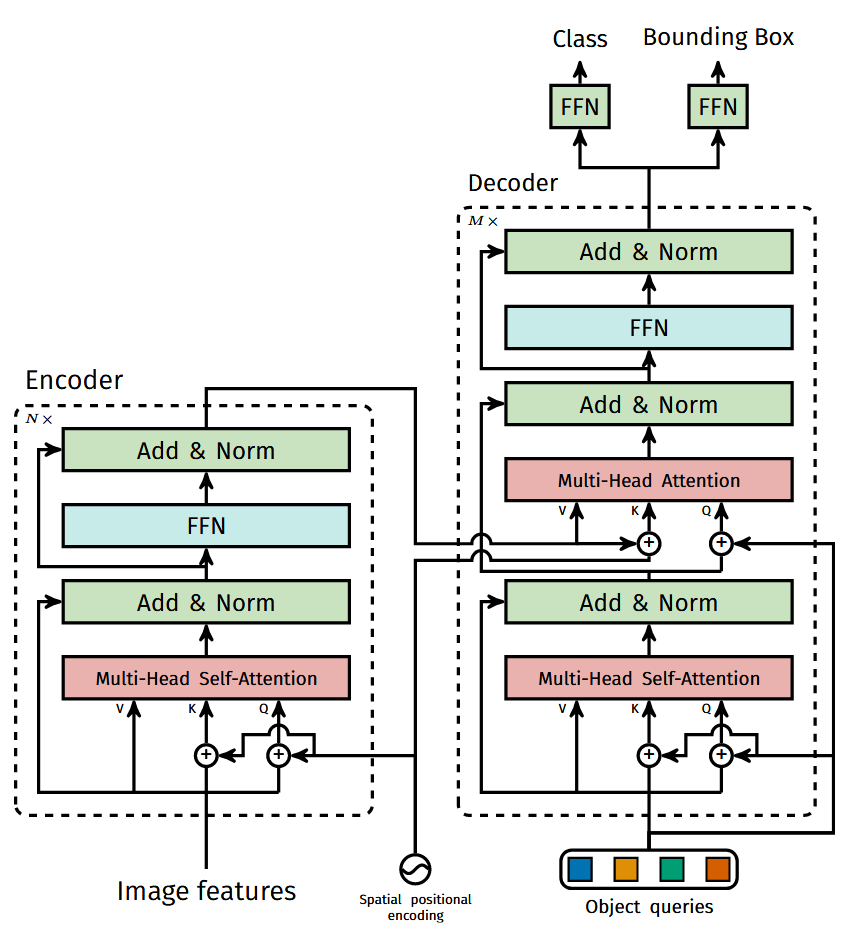

> 视觉三维目标检测在纯视觉自动驾驶扮演着重要的角色，其检测精度逐年提高，在海量数据的训练，精度已经可以和激光雷达相似。技术上，经历了“图像-> 伪点云 -> BEV -> Query-based”。这篇主要梳理当前主流的基于Query的稀疏目标检测方法。

## DETR
DETR开启了基于Transformer检测器的新时代，其重要意义是：去掉NMS真正做到了端到端的目标检测。得益于Transformer的灵活性和对海量数据的表达能力，后续工作极大的提升了目标检测的性能。

DETR的模型结构很简洁，见下图，DETR模型的重点在Decoder部分，Encoder部分使用ViT或者CNN提取特征并不重要。



上面结构中，引人注意的是**object queries**，使用观法的代码说明decoder部分的主要逻辑(object queries=`query_embed`)
```python
def forward(self, src, mask, query_embed, pos_embed):
    # flatten NxCxHxW to HWxNxC
    bs, c, h, w = src.shape
    src = src.flatten(2).permute(2, 0, 1)
    pos_embed = pos_embed.flatten(2).permute(2, 0, 1) # sine postion encoding
    query_embed = query_embed.unsqueeze(1).repeat(1, bs, 1) # object query in paper
    mask = mask.flatten(1)

    tgt = torch.zeros_like(query_embed)
    memory = self.encoder(src, 
                        src_key_padding_mask=mask, 
                        pos=pos_embed)

    
    # hs = self.decoder(tgt, memory, memory_key_padding_mask=mask,
    #                     pos=pos_embed, query_pos=query_embed)
    # 下面的代码是对self.decoder的进一步拆解
    output = tgt
    for layer in self.layers:
        tgt2 = self.norm1(tgt)
        # 在decoder中的第一层self attn使用object query更新前一层的输出tgt(tgt是目标query)
        q = k = self.with_pos_embed(tgt2, query_embed) 
        tgt2 = self.self_attn(
            q, k, value=tgt2, 
            attn_mask=tgt_mask,
            key_padding_mask=tgt_key_padding_mask)[0]
        tgt = tgt + self.dropout1(tgt2)
        tgt2 = self.norm2(tgt)
        # 在decoder中的第二层corss attn将object query加到第一层的输出
        tgt2 = self.multihead_attn(
            query=self.with_pos_embed(tgt2, query_embed),
            key=self.with_pos_embed(memory, pos),
            value=memory, attn_mask=memory_mask,
            key_padding_mask=memory_key_padding_mask)[0]
        tgt = tgt + self.dropout2(tgt2)
        tgt2 = self.norm3(tgt)
        tgt2 = self.linear2(
            self.dropout(
                self.activation(
                    self.linear1(tgt2)
                    )
                )
            )
        tgt = tgt + self.dropout3(tgt2)
    
    return tgt.unsqueeze(0).transpose(1, 2), \
            memory.permute(1, 2, 0).view(bs, c, h, w)

```


### [TODO] DETR的改进
DETR有收敛慢，全局attention很浪费的问题。

## DETR3D
DETR3D是DETR使用在3D目标检测的开篇工作。简单来说：
- 使用一组object query来预测一组三维参考点(目标框中心点)：$c_{li}=\Phi^{ref}(\mathbf{q}_{li}) \in \mathbb{R^3}$
- 参考点投影到图像的像素位置：$c_{lmi}=P\cdot c_{li}$
- 根据参考点像素从多尺度的图像特征中采样：$\mathbf{f}_{lkmi}=f^{bilinear}(F_{img, c_{lmi}}) \rightarrow f_{li}=\sum_{k}\sum_{m}\mathbf{f}_{lkmi}$
- 和object query进行融合：$\mathbf{q}_{(l+1)i}=\mathbb{f}_{li}+\mathbf{q}_{li}$
- 得到的object query在下一层中进行self attention

可以用下面的逻辑图更好的理解DETR3D的过程：


