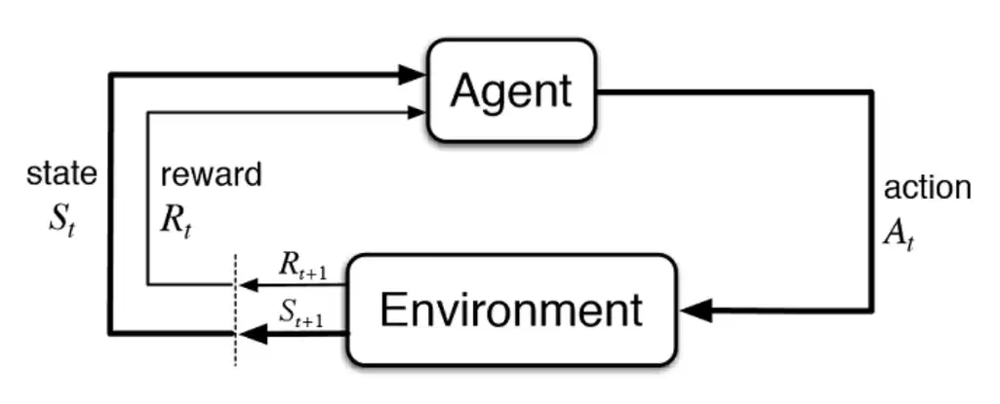

> 拾起Reinforcement Learning的基础概念和算法。

## Terminology
> 强化学习中有很多的术语和概念，初学时经常被搞得很懵逼，所以先从术语开始，把基础的概念理解好。

强化学习是一套框架，这套框架通用的描述一个可以执行动作的所谓Agent通过和环境的交互进行学习，框架图如下图所示：


**强化学习这套框架中充满了随机性**，每一个概念几乎都是一个随机变量或概率密度函数，下面的开始的介绍中，简单规定一些符号：大写字母$X$表示随机变量，小写字母$x$表示随机变量的观测值，大写的$P$概率密度函数，花体字母$\mathcal{S}$表示集合。不同的教材对下面的概念会采用相当不同的符号表示，例如David Silver的课程，UCB的课程等，不同的符号系统随着概念和算法的深入公式会变得更困难，因此坚持一套符号表示即可。

### Basics
1. **Agent:**
Agent是环境中活动（执行动作）的主体，例如在真实世界中行驶的自动驾驶车（Ego Vehicle）。

2. **Environment**
环境或者现在的有些说法叫世界模型（World Model），是Agent所活动的环境的抽象。

3. **State $S$:** 
状态指的是当前Agent所包含的信息，这些信息决定着Agent的未来。在某时刻$t$的状态$S_t$是一个随机变量，$s_t$是当前时刻的观测值，可以有很多可能的$s_t$。所有可能的状态的集合称为状态空间$\mathcal{S}$，即State Space。

4. **Action $A$:**
动作指的是Agent采取的动作。在某时刻$t$的状态$A_t$是一个随机变量，$a_t$是当前时刻的观测值，可以有很多可能的$a_t$，这些动作可能是离散值，也可能是连续值。所有可能的动作的集合称为动作空间$\mathcal{A}$，即Action Space。

5. **Reward $R$:**
奖励指的是Agent采取了动作环境给予Agent的奖励值。在某时刻$t$的状态$R_t$是一个随机变量，$r_t$是当前时刻的观测值。奖励也会被称为奖励函数（reward function），环境根据当前的状态$s_t$和采取的不同动作$a_t$，会有不同的奖励值。

    奖励也是一个很难的话题，因为RL是一个框架，Agent的目标是**最大化**未来的奖励，它塑造了Agent的学习目标和效率。很难有通用的奖励函数，一般是根据某个任务定义的，例如AlphaGo下棋，赢了得到了价值100的奖励，输了要惩罚100，这里奖励值的确定并没有科学的依据。例如在大语言模型应用强化学习进行RLHF，最大化的奖励是和人类对齐(alignment)的回答，但是模型也会出现Reward Hacking[^1]。

    RL算法也经常会面临奖励稀疏(Sparse Reward)的问题，导致RL比较大的问题是学习低效(inefficient)，即需要超级大量的试错才能学到简单的动作。

[^1]: [Reward Hacking in Reinforcement Learning](https://lilianweng.github.io/posts/2024-11-28-reward-hacking/)

6. **Return $U$:**
回报的定义是累积的**未来**回报(Cumulative **future** reward)，注意是**未来**:
$$
U_t=R_t+R_{t+1}+R_{t+2}+R_{t+3}+\cdots
$$

由于未来时刻$t$的奖励和当前比不一定等价，所以打个折扣$\gamma$，也就是discounted return:

$$
U_t=R_t+\gamma R_{t+1}+\gamma^2R_{t+2}+\gamma^3R_{t+3}+\cdots
$$

需要注意的是$U_t$是一个随机变量，它依赖于未来未观测到的奖励，而这些奖励依赖于未来采取的动作和状态，但是回报可以通过积分掉未观测到的变量获得**期望值**。

7. **Trajectory:** 
轨迹是Agent与环境交互的序列：$s_1, a_1, r_1, s_2, a_2, r_2, \cdots$

8. **State Transition:**
状态转移$p(\cdot \vert s, a)$指的是根据当前Agent的状态$s$和采取的动作$a$，环境转移到新状态$s'$的概率，因此状态转移时一个概率密度函数$p(s'\vert s,a)=P(S'=s' \vert S=s, A=a)$。

### Policy Function
**策略函数**$\pi$是RL中最重要的概念之一，是指Agent当前的状态$s$映射到动作空间$\mathcal{A}$内所有动作的**概率分布**，它控制Agent所采取的动作:
$$
\pi(a \vert s)=P(A=a \vert S=s)
$$
它是一个概率密度函数，所以有$\sum_{a \in \mathcal{A}}\pi(a \vert s)=1$。

### Value Functions
**价值函数**同样也是RL中最重要的概念之一，主要有动作-价值函数，以及状态-价值函数，两者有密切关系。
**两个价值函数都是由策略函数Policy控制的期望，期望就是对未来回报的平均预期**，比喻来说就是Agent的“经验”。
#### Action-Value Function
动作价值函数$Q_{\pi}(s, a)$，即经常见到的$Q$函数，描述了在给定状态$s$下采取某个动作$a$的好坏，这个好坏是通过代表未来累积奖励的回报$U_t$的期望来进行评价的:
$$
Q_{\pi}(s, a)=\mathbb{E}(U_t \vert S_t=s_t, A_t=a_t)
$$

为什么是期望呢？因为未来（$t+1$时刻之后）可能采取的动作和进入的状态都是随机变量，但是我们通过求期望，即通过概率加权求和或积分消掉未来的随机变量，从而大体知道可以预期的平均回报是多少。

$Q$函数依赖策略函数$\pi(a \vert s)$和状态转移函数$p(\cdot \vert s, a)$。

#### State-Value Function
状态价值函数$V_{\pi}$衡量给定策略$\pi$，当前状态的好坏，相当于对动作价值函数$Q$，进一步积分掉所有的动作$A$：
$$
V_{\pi}=\mathbb{E}_{A\sim \pi(\cdot \vert s_t)}\big[Q_{\pi}(s_t, A) \big]=\int_{\mathcal{A}} \pi(a\vert s_t) \cdot Q_{\pi}(s_t,a) \, da
$$
状态价值函数描述了给定策略$\pi$现在所处的状态的好坏，不管采取什么动作。

#### Optimal Value Functions
**最佳动作价值函数(Optimal action-value function)：** $Q^*(s, a)$表示在策略函数$\pi$和状态$s$下采取动作$a$的最大预期回报： 
$$
\begin{aligned}
    Q^*(s, a) &= \underset{\pi}{\text{max}} \, Q_{\pi}(s,a)
\end{aligned}
$$

**最佳状态价值函数(Optimal state-value function)：** $V^*(s)$表示在策略函数$\pi$中当前状态$s$的最大预期回报：
$$
V^{*}(s) = \underset{\pi}{\text{max}} \, V_{\pi}(s)
$$

可以看到，两个最佳价值函数（$Q^*(s,a)$和$V^*(s)$）都和策略函数$\pi$有关，即只要找到**最佳的策略函数$\pi^*(a\vert s)$：**
$$
\pi \geq \pi' \quad \text{if} \, V_{\pi}(s) \geq V_{\pi'}(s) , \forall s
$$

对任意马尔科夫决策过程MDP有**定理**：

1. **一定有一个最佳策略$\pi^*(a\vert s)$好于或等于其他所有的策略**
2. **最优策略一定实现最优状态价值函数，$V_{\pi^*}(s) \geq V^*(s), \forall \pi$**
3. **最优策略一定实现最优动作价值函数，$Q_{\pi^*}(s,a) \geq Q^*(s,a), \forall \pi$**

RL算法的目标是最大化未来累积回报，可以看到，如果已知最优价值函数或最优策略，都可以实现RL这一目标，因此RL算法主要分为Value-based和Policy-based的方法。

## Policy-based Method
Policy-based方法，例如Policy Gradient，是直接建模策略函数$\pi(a\vert s; \theta)$来实现最大化未来累积回报的预期：
$$
\text{maximize} \, \mathcal{J}(\theta)=V_{\pi_{\theta}}(S_1)= \mathbb{E}_{\pi_{\theta}}[V_1]
$$
其中，$S_1$是初始状态。

期望累积奖励可以表示为平稳分布下的期望[^2]：
$$
\mathcal{J}(\theta)=\sum_{s\in \mathcal{S}}d_{\pi_{\theta}}(s)V_{\pi_{\theta}}(s)=\sum_{s\in \mathcal{S}}\big(d_{\pi_{\theta}}(s)\sum_{a\in \mathcal{A}}\pi(a\vert s,\theta)Q_{\pi}(s,a) \big)
$$
其中，$d_{\pi_{\theta}}(s)$称为平稳分布(stationary distribution)。

[^2]: [Policy Gradient](https://lilianweng.github.io/posts/2018-02-19-rl-overview/#policy-gradient)

:::note
什么是平稳分布(Stationary Distribution) ?

平稳分布是马尔可夫链（Markov Chain）中的一个核心概念，描述了一个系统在长期演化后达到的稳定状态。对于离散时间马尔可夫链（Discrete-Time Markov Chain, DTMC），若存在一个概率分布$\pi$满足：
$$
\pi=\pi P
$$
其中$P$是状态转移矩阵，则$\pi$为该马尔可夫链的平稳分布。

直观理解就是：若初始状态服从分布$\pi$，则经过任意次状态转移后，状态分布仍保持为$\pi$。
:::

:::tip
在[Wang Shusen老师](https://github.com/wangshusen/DeepLearning/blob/master/Slides/13_RL_3.pdf)的课程中，目标函数的表示有些许不同，但是是等价的。Wang Shusen老师课程中的目标函数：
$$
\mathcal{J}(\theta)=\mathbb{E}_{S}[V(S;\theta)]
$$
:::

### Policy Gradient
对上面的目标函数解析的求梯度(这里参考的是[Wang Shusen](https://github.com/wangshusen/DeepLearning/blob/master/Slides/13_RL_3.pdf)的简化版）：
$$
\begin{aligned}
    \frac{\partial \mathcal{J}(\theta)}{\partial \theta}&=\frac{\partial \sum_{s\in \mathcal{S}}d(s)\sum_{a}\pi(a\vert s;\theta)\cdot Q_{\pi}(s,a)}{\partial \theta} \\
    &=\sum_{s\in \mathcal{S}}d(s)\sum_{a\in\mathcal{A}} \frac{\partial \pi(a\vert s;\theta)\cdot Q_{\pi}(s,a)}{\partial \theta} \\
    &=\sum_{s\in \mathcal{S}}d(s)\sum_{a} \frac{\partial \pi(a\vert s;\theta)}{\partial \theta}\cdot Q_{\pi}(s,a) \quad \text{via}\nabla f(x)=f(x)\nabla\log f(x)\\
    &=\sum_{s\in \mathcal{S}}d(s)\sum_{a}\pi(a\vert s;\theta) \frac{\partial \log \pi(a\vert s;\theta)}{\partial \theta}\cdot Q_{\pi}(s,a) \quad \text{via} \sum_{s\in \mathcal{S}}d(s)=1 \\
    &=\mathbb{E}_{\mathcal{A}}\big[\frac{\partial\log\pi(A\vert s;\theta)}{\partial \theta}\cdot Q_{\pi}(s,A) \big] \\
    &=\mathbb{E}_{\mathcal{A}}[\nabla_{\theta} \log\pi(A\vert s;\theta)\cdot Q_{\pi}(s,A)]
\end{aligned}
$$

$\nabla_{\theta}\mathcal{J}(\theta)$称为策略梯度(Policy gradient)，注意的是它是一个期望值，**请记住这个公式**。

:::note
**Score Function**

score function（评分函数）定义为**对数似然函数关于参数的梯度**，这个不太像是人话，直白的说就是有一个概率分布$p(x;\theta)$，它的参数是$\theta$，想要关于参数$\theta$求导：
$$
s(\theta)=\nabla_{\theta}\log p(x;\theta)
$$
核心性质：

- **期望为零：** $\mathbb{E}[s(\theta)]=0$，即微小的变化对score的平均影响为$0$
- **方差与Fisher information：** $Var[s(\theta)]$称为Fisher information, 用于衡量参数估计的精度

**策略梯度的核心是梯度。**

PS: 策略梯度中的$\nabla_{\theta} \log\pi(A\vert s;\theta)$即为策略函数$\pi(a\vert s;\theta)$的score function。

PS2: 为什么叫score function这么奇怪的名字？LLM给出的解释是：梯度指示了参数空间中“得分”增长最快的方向，量化评分参数的合理程度，得分越高，参数越合理。

**另外，生成模型中的score-based model，和上面有一些不同，score-based model是指数据分布的对数概率梯度：$s(x)=\nabla_{x}\log p(x)$**
:::

#### Gradient Ascent
策略梯度算法使用梯度上升来更新参数(梯度下降用于最小化目标函数，对应的梯度上升用来最大化目标函数)，伪代码如下：

1. 从环境中得到状态$s_t$
2. 从策略函数$\pi(\cdot\vert s_t;\theta)$中随机抽样出$a_t$ 
3. 计算$q_t \approx Q_{\pi}(s_t, a_t)$ $\leftarrow$ 下文回讲如何计算$q_t$
4. 求梯度: $\mathbb{d}_{\theta, t}=\frac{\partial \log\pi(\red{a_t}\vert s_t, \theta)}{\partial \theta} \big\vert_{\theta=\theta_t}$
5. (近似)计算policy gradient: $\mathbf{g}(\red{a_t},\theta_t)=q_t\cdot \mathbb{d}_{\theta, t}$ $\leftarrow$这里是使用蒙特卡洛近似，只使用一次随机采样来估计policy gradient(回想一下policy gradient是期望)
6. 更新模型参数：$\theta_{t+1}=\theta_t + \beta \cdot \mathbf{g}(\red{a_t},\theta_t)$

> **使用蒙特卡洛近似的方法对policy gradient是无偏估计，但是它的缺点是<strong style="color: red;">方差高</strong>。**

还有一个问题：**如何求$Q_{\pi}(s_t, a_t)$**？使用**REINFORCE**方法:

- 使用当前的策略函数$\pi$执行直到结束，收集轨迹：$s_1, a_1, r_1, s_2, a_2, r_2, \cdots, s_T, a_T, r_T$
- 计算$u_t=\sum_{k=t}^{T}\gamma^{k-t}r_k$
- 因为$Q_{\pi}(s_t,a_t)=\mathbb{E}[U_t]$，我们使用$u_t$来近似$Q_{\pi}(s_t,a_t)$

REINFORCE还有一个样本效率低的问题：执行当前策略$\pi_{old}$收集到的轨迹后，更新参数得到了策略函数$\pi_{new}$，这时之前收集到的轨迹就完全没有办法使用了。REINFORCE属于严格的on-policy算法。

另外一个方法是使用一个网络来近似$Q_{\pi}(s_t, a_t)$，这个就属于Actor-Critic方法了，在后面[小节](#actor-critic-method)进行。

### Policy Gradient with Baseline 
前述使用MC采样的Policy Gradient算法的问题是方差较高，学者引入Baseline技巧，可以实现降低方差的作用。

首先来看一个推导：
$$
\begin{aligned}
    \quad &\mathbb{E}_{A\sim \pi}[\blue{b}\cdot \nabla_{\theta} \log\pi(A\vert s;\theta)] \\
    =& \blue{b} \cdot \mathbb{E}_{A\sim \pi}[\nabla_{\theta} \log\pi(A\vert s;\theta)] \\
    =& \blue{b} \cdot \sum_{a}\pi(a\vert s;\theta) [\frac{\partial \log \pi(a\vert s;\theta)}{\partial \theta}] \quad \text{via }\frac{d}{dx} \log(f(x)) = \frac{1}{x}f'(x)\\
    =& \blue{b} \cdot \sum_{a} \cancel{\pi(a\vert s;\theta)}[\frac{1}{\cancel{\pi(a\vert s;\theta)}}\cdot \frac{\partial \pi(a\vert s;\theta)}{\partial \theta}] \\
    =& \blue{b} \cdot \frac{\partial\sum_{a}\pi(a\vert s;\theta)}{\partial \theta} \\
    =& \blue{b} \cdot \frac{\partial 1}{\partial \theta} \\
    =& 0
\end{aligned}
$$
$b$就是baseline，只要$b$和求导的参数$\theta$以及动作$a$无关，它的期望就是$0$，所以把上式添加到Policy Gradient中，不改变Policy Gradient的期望值：
$$
\begin{aligned}
    PG =& \mathbb{E}_{\mathcal{A}}\big[\nabla_{\theta} \log\pi(A\vert s;\theta) \cdot Q_{\pi}(s,A) \big] \\
    =& \mathbb{E}_{\mathcal{A}}\big[\nabla_{\theta} \log\pi(A\vert s;\theta) \cdot Q_{\pi}(s,A) - \nabla_{\theta} \log\pi(A\vert s;\theta)\cdot\blue{b}\big] \\
    =& \mathbb{E}_{\mathcal{A}}[\nabla_{\theta} \log\pi(A\vert s;\theta)\cdot(Q_{\pi}(s,A)-\blue{b})]
\end{aligned}
$$
其中，$A(s,a)=Q_{\pi}(s,a)-\blue{b}$又称为**Advantage函数**。

但是为什么要加呢？虽然不改变期望值，但是在使用蒙特卡洛近似(随机采样$a_t$并计算$g_t$)时，选择合适的baseline，可以降低方差。baseline的选择有很多，$b$可以为常数，更常见的选择是$b=V(s)$，即$A(s,a)=Q_{\pi}(s,a)-\blue{b}=Q_{\pi}(s,a)-V_{\pi}(s)$。
直观的解释Advantange函数的话就是：
- $A(s,a) > 0$，则表示当前动作$a$的回报优于平均值
- $A(s,a) < 0$，则表示当前动作$a$的回报低于平均值

### TRPO
TRPO全称是Trust Region Policy Optimization，是优化策略函数的方法，将数值优化领域的Trust Region优化巧妙应用到策略函数的优化。

#### Trust Region
单独拿出来Trust Region是因为这不是TRPO的发明，而是数值优化领域的算法，首先理解Trust Region的基础，可以更好的理解TRPO。这里推荐Wang Shusen老师的视频[TRPO 置信域策略优化](https://www.youtube.com/watch?v=fcSYiyvPjm4)，非常清晰。

假设$\mathcal{N}(\theta_{\text{old}})$是参数$\theta_{\text{old}}$的邻域，即这个邻域内的参数距离$\theta_{\text{old}}$在一定的距离之内，度量距离有多种选择，例如KL散度。
**如果我们有一个函数，$L(\theta \vert \theta_{\text{old}})$在$\mathcal{N}(\theta_{\text{old}})$内近似$\mathcal{J}(\theta)$，那么称$\mathcal{N}(\theta_{\text{old}})$为Trust Region。**

Trust Region算法重复两件事情：

1. **Approximation**: 给定当前参数$\theta_{old}$，构建$L(\theta \vert \theta_{\text{old}})$，它是在邻域$\mathcal{N}(\theta_{\text{old}})$内对目标函数$J(\theta)$的近似
2. **Maximization**: 在Trust Region，更新参数$\theta_{\text{new}}$: $\theta_{\text{new}} \leftarrow \underset{\theta \in \mathcal{N}(\theta_{\text{old}})}{\text{argmax}}\,L(\theta\vert \theta_{\text{old}})$

#### TR Policy Optimization
首先，重新改写目标函数$\mathcal{J}(\theta)$，其中的技巧是重要性采样:
$$
\begin{aligned}
    \mathcal{J}(\theta) &= \mathbb{E}_{S}[V_{\pi}(S)] \\
    &= \mathbb{E}_{S}\big[\sum_{a}\pi(a\vert s;\theta)\cdot Q_{\pi}(s,a)] \\
    &= \mathbb{E}_{S}\big[\pi(a\vert s;\theta_{\text{old}}) \cdot \frac{\pi(a\vert s;\theta)}{\pi(a\vert s;\theta_{\text{old}})} \cdot Q_{\pi}(s,a) \big] \\
    &= \mathbb{E}_{S}\Big[\mathbb{E}_{A \sim \pi(\cdot\vert s;\theta_{\text{old}})}\big[\frac{\pi(a\vert s;\theta)}{\pi(a\vert s;\theta_{\text{old}})} \cdot Q_{\pi}(s,a) \big]\Big] \\
    &= \mathbb{E}_{S,A}\big[\frac{\pi(A\vert S;\theta)}{\pi(A\vert S;\theta_{\text{old}})} \cdot Q_{\pi}(S,A) \big]
\end{aligned}
$$
TRPO论文中是**使用Advantage函数来替代$Q$函数**的，公式推导和理解上差异不大，这里与Wang Shushen老师的课程中的公式一致。

:::note
$\theta_{\text{old}}$是什么？

理解$\theta_{\text{old}}$需要理解策略梯度的训练过程：
1. Rollout（数据收集）：由于TRPO的on-policy特性，每次更新梯度，需要使用当前参数($\theta_{\text{old}}$)的策略与环境交互，得到轨迹数据，这些数据用于使用梯度上升进行参数更新；为了加快rollout，gym环境使用Vectorized Environments并行化的模拟
2. 使用Rollout得到的数据作为训练数据训练policy，因此公式中的$\theta$就是当前的正要更新的模型参数，因为要支持多轮的梯度更新，使用的都是同一批使用$\theta_{\text{old}}$得到的轨迹数据，这里应该可以更好的理解为什么写为$\theta_{\text{old}}$：
```python
rollout_data = agent.policy_rollout()
for epoch in range(update_epochs):
    obs_old, actions_old, logprobs_old = sample_rollout_actions(rollout_data)
    new_action, new_value = \
        agent.get_action_value(obs_old, actions_old)
    logratio = logprobs_new - logprobs_old
    ratio = logratio.exp() # \pi(\theta) / \pi(\theta_old)
    # ... gradient ascent
```
:::

在做重要性采样时，如果提议分布和目标分布差异过大，是没有办法进行优化的，因此我们假设的也是当前策略函数的分布$\theta_{\text{old}}$和将要优化的策略函数的分布非常的近似，因此在Trust Region小步更新，更新步长太大也会造成优化不稳定。

:::tip
**重要性采样(Importance Sampling)**

Importance Sampling是一种估计目标分布期望的技巧。当无法直接从目标分布$p(x)$时，通过另一个提议分布$q(x)$生成样本，并使用权重$\frac{p(x)}{q(x)}$修正期望值：
$$
\mathbb{E}_{x \sim p}[f(x)] = \mathbb{E}_{\mathbb{x \sim q}} \big[ \frac{p(x)}{q(x)}\cdot f(x) \big]
$$
:::

下面开始应用Trust Region的两步(Approximation和Maximization)来优化目标函数：

**Step 1. Approximation**: 在参数$\theta_{\text{old}}$的邻域内构建$L(\theta\vert \theta_{\text{old}})$近似$\mathcal{J}(\theta)=\mathbb{E}_{S,A}\big[\frac{\pi(A\vert S;\theta)}{\pi(A\vert S;\theta_{\text{old}})} \cdot Q_{\pi}(S,A) \big]$

由于$S$和$A$都是状态和动作的随机变量，可以从状态转移函数和$\pi$函数中随机采样得到，使用$\pi(A\vert s;\theta_{\text{old}})$和概率转移函数得到一组轨迹：$s_1,a_1,r_1,s_2,a_2,r_2,\cdots,s_n,a_n,r_n$，这些轨迹点相当于是训练策略函数$\pi_{\theta}$的训练数据。
使用这组轨迹（蒙特卡洛）近似$\mathcal{J}(\theta)$:
$$
\mathcal{J}(\theta)\approx L(\theta\vert\theta_{old})=\frac{1}{n}\sum_{i=1}^{n}\frac{\pi(a_i\vert s_i;\theta)}{\pi(a_i\vert s_i;\theta_{old})}\cdot Q_{\pi}(s_i,a_i)
$$
上式中，$Q_{\pi}(s_i,a_i)$可以使用REINFORCE方法用roll out的轨迹进行估计，即$u_i$，则：
$$
\tilde{L}(\theta\vert\theta_{old})=\frac{1}{n}\sum_{i=1}^{n}\frac{\pi(a_i\vert s_i;\theta)}{\pi(a_i\vert s_i;\theta_{old})}\cdot u_i
$$

:::important
PPO论文中使用的是Generalized Advantage Estimation (GAE)来代替Policy Gradient的Advantage函数。

回忆一下Advantage函数定义：$A_{\pi}(s,a)=Q_{\pi}(s,a)-V_{\pi}(s)$，它衡量当前动作的预期回报相对于平均水平的高低，但是仍然避免不了高方差的问题。GAE结合时序差分（TD）误差的加权和来估计优势函数，从而在偏差和方差之间取得平衡。可以参考这里的实现[Generalized Advantage Estimation (GAE)](https://nn.labml.ai/rl/ppo/gae.html)。
:::

**Step 2. Maximization**: 在Trust Region，更新参数$\theta_{\text{new}}$:
$$
\theta_{\text{new}} \leftarrow \underset{\theta \in \mathcal{N}(\theta_{\text{old}})}{\text{argmax}}\,\tilde{L}(\theta\vert \theta_{\text{old}}); \quad \text{s.t.} \theta\in \mathcal{N}(\theta_{\text{old}})
$$
这是一个带约束的优化问题，求解这个问题比较复杂，可以简单理解一个二阶优化问题，即使用到了Hessian矩阵。因此，后续PPO对此进行了改进。

### PPO
近端策略优化算法是对TRPO算法的改进，TRPO有训练稳定的优点，但是使用二阶计算量较大。
PPO是对TRPO的改进，主要是对比较复杂的带约束的最优化问题进行了简化，可以使用一阶的优化算法进行，大大加快了效率。

我们回顾一下TRPO的带约束的优化问题：
$$
\begin{aligned}
    &\underset{\theta}{\text{maximize}} \quad \mathbb{E}\big[\frac{\pi(a\vert s;\theta)}{\pi(a\vert s;\theta_{\text{old}})}A_{\pi_{\text{old}}}(s,a) \big] \\ 
    &\text{s.t.} \quad \mathbb{E}[D_{KL}(\pi_{\theta_{\text{old}}}(\cdot\vert s) \parallel \pi_{\theta}(\cdot \vert s))] \leq \delta
\end{aligned}
$$

[PPO算法](https://arxiv.org/pdf/1707.06347)有两个变体，相对TRPO来说都很简洁，它们是$\text{PPO}^{KLPEN}$和$\text{PPO}^{CLIP}$，其中$\text{PPO}^{CLIP}$效果更好，更常见。

#### PPO Penalty
$\text{PPO}^{KLPEN}$，把约束项$D_{KL}$放入到目标函数中去（有些类似拉格朗日乘子法），就变成了无约束的优化问题，这样就可以直接使用各种一阶优化算法了，例如SGD，ADAM：
$$
\mathbb{E}\big[\frac{\pi(a\vert s;\theta)}{\pi(a\vert s;\theta_{\text{old}})}A_{\pi_{\text{old}}}(s,a) \big] - \beta \cdot \mathbb{E}[D_{KL}(\pi_{\theta_{\text{old}}}(\cdot\vert s) \parallel \pi_{\theta}(\cdot \vert s))]
$$

其中的$\beta$是一个自适应的调整项，需要一个作为超参数的$d_{\text{target}}$，首先计算$d=\mathbb{E}[D_{KL}(\pi_{\theta_{\text{old}}}(\cdot\vert s) \parallel \pi_{\theta}(\cdot \vert s))]$:

- 如果$d < d_{\text{target}} / 1.5 \rightarrow \beta=\beta / 2$ 
- 如果$d > d_{\text{target}} \times 1.5 \rightarrow \beta=\beta \times 2$

#### PPO CLIP
$\text{PPO}^{CLIP}$对Trust Region的进行了简化，通过控制重要性采样比率控制更新的补偿。令重要性采样比率为$r(\theta)=\frac{\pi(a;\theta)}{\pi(a;\theta_{\text{old}})}$，对$r(\theta)$进行截断，并选择最小（“悲观”）的那一项：
$$
L^{CLIP}(\theta)=\mathbb{E}[\text{min}(r(\theta)A_{\pi_{\text{old}}}(s,a), \text{clip}(r(\theta), 1-\epsilon, 1+\epsilon))A_{\pi_{\text{old}}}(s,a)]
$$
$\text{PPO}^{CLIP}$是更常见的目标函数，论文的实验中也有更好的表现。

PPO论文作者在第5节中提到，很多方法会使用一个网络来估计advantage函数中的$V_{\pi}(s)$，如果policy网络和value网络共享参数，需要增加价值函数项$L^{VF}$和熵奖励项(Entropy Bonus)$S$，写作：
$$
L^{CLIP+VF+S}=\mathbb{E}[L^{CLIP}(\theta)-c_1L^{VF}(\theta)+c_2S[\pi_{\theta}(s)]]
$$
其中的$c_1, c_2$都是超参数，其他两项：

- $L^{VF}=(V_{\theta}(s)-V^{target})^2$，$V^{target}$可以通过广义优势估计(General Advantage Estimation, GAE)得到。

- $S[\pi_{\theta}(s)]=\mathbb{E}[-\pi_{\theta}(a\vert s)\log \pi_{\theta}(a\vert s)]$，这一公式是从熵的定义中来，熵越大表明信息量越大，目标函数鼓励这一项更大（因为使用的是$+$号），可以估计模型增加探索，因为$\pi$函数控制动作。

> PPO的算法的实现[^4]有非常多的细节和技巧，对于复现PPO算法很重要，有博客[^3]总结了PPO实现的各种细节，会再另外一篇博客中单独叙述。

[^3]: [The 37 Implementation Details of Proximal Policy Optimization](https://iclr-blog-track.github.io/2022/03/25/ppo-implementation-details/)
[^4]: [Clean RL PPO](https://docs.cleanrl.dev/rl-algorithms/ppo/)


## Valued-based Method
[Value函数](#value-functions)的定义即为对未来回报的期望，因此直接使用函数来近似动作/状态价值函数(Value Functions)称为基于价值函数的算法。

### DQN
深度学习时代，经典的Deep Q Network就是使用深度网络$Q(s,a ;\mathbf{w})$来近似动作价值函数$Q(s,a)$，并用来控制Agent的动作：
$$
a_t=\underset{a}{\text{argmax}} \, Q(s_t, a;\mathbf{w})
$$
每次贪心地选择最大化价值的动作，则得到最佳动作-价值函数$Q^*(s,a)$。

我们不对DQN的网络做过多解读，举一个简单的打马里奥的例子，游戏的动作动作是$\mathcal{A}=[\text{left}, \text{right}, \text{up}]$，网络的输入是当前的图像，输出是每个动作的价值，例如$[200, 100, 150]$，每次选择最大价值的动作。

#### Temporal Difference
**如何训练DQN呢？** 一般使用TD Learning进行训练。

RL是时序决策框架，通常以一个片段(episode)为基础，即一定会包含终止的状态。在某时刻$t$，使用$Q(s_t, a;\mathbf{w})$来估计不同动作的未来预期回报，但是什么时候才会得到未来预期回报的真值(GroundTruth)呢？那显然得得等到这个片段结束才会知道真值，使用梯度下降来更新模型参数，这样效率就会比较低下。

能不能在片段没有结束之前进行更新模型参数呢？可以，因为经过了某些步数之后，获得了这部分奖励的真值，可以使用这部分的真值来更新最初的预测，即每一步都修正之前的预测，每一步都更新模型的参数。

回报$U_t$包含一定的递归属性：$U_t=R_t + \gamma R_{t+1} + \gamma^2 R_{t+2} + \gamma^3 R_{t+3} + \cdots=R_t + \gamma U_{t+1}$。

把上面关于$U_t$的递归方程应用在DQN中：
$$
\underbrace{Q(s_t,a;\mathbf{w})}_{\text{Estimate of }U_t} \approx \mathbb{E}[r_t+\gamma\cdot \underbrace{Q(S_{t+1}, A_{t+1}; \mathbf{w})]}_{\text{Estimate of }U_{t+1}} 
$$
把求期望括号内的部分称为TD Target:
$$
\underbrace{Q(s_t,a;\mathbf{w})}_{\text{Prediction}} \approx  \mathbb{E}\underbrace{[r_t+\gamma\cdot Q(S_{t+1}, A_{t+1}; \mathbf{w})]}_{\text{TD Target}}
$$
有了Prediction和Target，就可以构建常见的损失函数更新模型参数了，令：
$$
\begin{aligned}
    y_t &= r_t + \gamma \cdot Q(s_{t+1},a_{t+1};\mathbf{w_t}) \\
        &= r_t + \gamma \cdot \underset{a}{\text{max}}Q(s_{t+1}, a; \mathbf{w_t})
\end{aligned}
$$
损失函数即为：
$$
L = \frac{1}{2}[Q(s_{t},a_{t};\mathbf{w_t})-y_t]^2
$$
梯度更新参数：
$$
\mathbf{w_{t+1}=\mathbf{w_t}-\alpha\cdot\frac{\partial L}{\partial w}\Big\vert_{w=w_t}}
$$

使用TD训练DQN的伪代码：
1. 获得状态$S_t=s_t$，执行动作$A_t=a_t$
2. 预测价值：$q_t=Q(s_t,a_t;\mathbf{w_t})$
3. 求微分：$\mathbf{d_t}=\frac{\partial Q(s_t,a_t;\mathbf{w_t})}{\partial \mathbf{w_t}} \big \vert_{w=w_t}$
4. 环境提供下一个状态$s_{t+1}$和当前的奖励$r_t$
5. 计算TD Target：$y_t=r_t + \gamma \cdot \underset{a}{\text{max}}Q(s_{t+1}, a; \mathbf{w_t})$
6. 使用梯度下降更新参数：$\mathbf{w_{t+1}}=\mathbf{w_t}-\alpha\cdot (q_t-y_t) \mathbf{d}_t$

## Actor-Critic Method
Actor-Critic Method是Value-based和Policy-based的结合，即使用模型同时对策略函数$\pi(a \vert s; \mathbf{\theta})$和动作-价值函数$Q_{\pi}(a,s;\mathbf{w})$进行建模。在前面[Policy Gradient的训练](#gradient-ascent)处已经提到使用模型来估计$Q$函数。

Actor指的是策略函数$\pi(a \vert s; \mathbf{\theta})$，用来控制动作的输出，Critic指的是动作-价值函数$Q_{\pi}(a,s;\mathbf{w})$，用来对采取的动作进行打分，两者同时训练，使得Agent对动作的预期回报的估计越来越准，也更有可能得到更好的动作：
$$
V_{\pi}(s)=\sum_a \pi(a \vert s; \mathbf{\theta}) \cdot Q_{\pi}(a,s;\mathbf{w})
$$

### Training Actor-Critic
同时训练策略函数$\pi(a \vert s; \mathbf{\theta})$和动作-价值函数$Q_{\pi}(a,s;\mathbf{w})$，需要分别用到前面的TD和梯度上升，伪代码如下：

1. 获得状态$s_t$
2. 根据$\pi(a \vert s; \mathbf{\theta})$随机采样动作$a_t$
3. 执行动作$a_t$，从环境中获得奖励$r_t$，并转移到下一个状态$s_{t+1}$
4. 使用TD更新Critic网络参数$\mathbf{w}$
    1. 从$\pi(\cdot \vert s_{t+1}; \mathbf{\theta})$采样动作$\tilde a_{t+1}$，但是并**不执行**$\tilde a_{t+1}$
    2. 使用$Q_{\pi}(a,s;\mathbf{w})$来计算：$q_t=Q(s_t, a_t;\mathbf{w_t})$和$q_{t+1}=Q(s_{t+1}, \tilde a_{t+1}; \mathbf{w_t})$
    3. 计算TD target: $y_t=r_t+\gamma \cdot q_{t+1}$
    4. 损失函数：$L(\mathbf{w})=\frac{1}{2}[q_t-y_t]^2$
    5. 梯度下降更新参数：$\mathbf{w_{t+1}}=\mathbf{w_t}-\alpha \cdot \frac{\partial L(\mathbf{w_t})}{\partial \mathbf{w}} \big |_{\mathbf{w}=\mathbf{w_t}}$
5. 使用policy gradient来更新参数$\mathbf{\theta}$
    1. 计算梯度: $\mathbb{d}_{\theta, t}=\frac{\partial \log\pi(a_t \vert s_t, \theta)}{\partial \theta} \big\vert_{\theta=\theta_t}$
    2. 更新参数：$\mathbf{\theta_{t+1}}=\mathbf{\theta}+\beta \cdot q_t \cdot \mathbb{d}_{\theta, t}$
6. 重复直到收敛

#### Policy vs Value vs Actor-Critic

| 方法 | 优点 | 缺点 |
| ----| :---- | :---- |
| Policy-based | 1.直接优化策略函数，适合连续动作空间 <br>2.支持随机策略（从策略函数中采样得到动作） | 1.**高方差**，训练不稳定 <br>2.采样效率低（on-policy），收敛速度慢 <br>3.可能陷入局部最优，对超参敏感|
| Value-based | 1.采样效率高：经验回放复用样本 <br>2.确定性策略，通过价值函数选择最佳动作 <br>3.收敛性较好 | 1.无法处理连续动作空间 <br>2.确定性策略函数灵活性差 <br>3.Q-learning的max操作导致价值函数高估 |
| Actor-Critic | 1.结合Policy和Value方法，平衡探索与利用(随机/确定性策略) <br>2.低方差，Critic估计逼policy方法方差更低 <br>3.可处理连续和离散动作空间 | 1.训练难度高，同时训练两个网络，调参难度大 <br>2.Critic估计的误差可能误导Actor <br>3.依赖Critic估计的准确性 |

### MISC

#### on-policy v.s off-policy
| 名称 | on-policy | off-policy |
| ----| :---- | :---- |
| 定义 | 行为策略(生成数据的策略)和目标策略(正在被优化的策略)必须是同一个策略 | 行为策略和目标策略不是同一个策略 |
| 特性 | 1.必须用当前策略与环境交互(rollout)的数据使用策略更新 <br>2.策略更新后之前的数据被扔掉，样本效率低 | 1.可复用历史数据，样本效率高 <br>2.行为策略可以更自由(如更注重探索)，而目标策略更注重优化 <br>3.数据来自不同策略，需处理分布的差异 |
| 算法 | 典型算法：REINFORCE, SARSA, PPO | 典型算法：Q-Learnig, DQN, DDPG |

#### model-free v.s model-based
**model-based方法：**

- 显式地学习动态模型，即转移函数$P(s' \vert s, a)$和奖励函数$R(s,a)$，利用该模型进行规划(Planning)，例如通过模拟环境预测未来状态，从而优化策略或价值函数
- 特点：依赖环境模型，通过模型生成的虚拟轨迹来辅助决策
- 典型算法：Monte Carlo Tree Search (MCTS)（如AlphaGo中的规划方法），[Dyna-Q](https://dl.acm.org/doi/pdf/10.1145/122344.122377), [PILCO](https://mlg.eng.cam.ac.uk/pub/pdf/DeiRas11.pdf)

**model-free方法：**

- **不**显式地学习动态模型，直接通过试错从经验中学习策略或价值函数，依赖与环境的实时交互数据，而非通过动态模型的预测
- 特点：不依赖动态模型，数据驱动，样本效率低，需要海量的交互数据；这也是目前主流的算法方向
- 典型算法：Q-Learning, DQN，REINFORCE， PPO，A3C