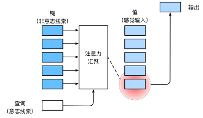
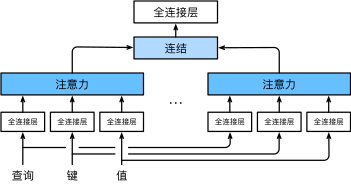

# Transformer notes
Transformer主要由题图中的三个部分组成：scaled dot-product attention, multi-head attention，Transformer achitecture。
笔记主要以这三部分为大纲，每个会包括论文的细节和一部份的代码实现。

## 感性理解注意力
听说过Transformer的人一定会见到Query, Key, Value这几个东西，为什么Query和Key要想相乘得到相似度后与Value进行加权和？ 如果你也有这样的疑问，可以从下面的内容有一个感性认识，如果只想了解技术部分，这里完全可以跳过。参考资料来自[动手深度学习中注意力机制](https://zh.d2l.ai/chapter_attention-mechanisms/index.html)

心理学中威廉·詹姆斯提出了双组件(two-component)框架：受试者基于**自主性提示**和**非自主性提示**有选择的引导注意力的焦点。自主性提示就是人主观的想要关注的提示，而非自主性提示是基于环境中物体的突出性和易见性。举一个下面的例子：

想象一下，假如你面前有五个物品： 一份报纸、一篇研究论文、一杯咖啡、一本笔记本和一本书，如下图。 所有纸制品都是黑白印刷的，但咖啡杯是红色的。 
这个咖啡杯在这种视觉环境中是突出和显眼的， 不由自主地引起人们的注意，属于**非自主性提示**。
但是，受试者可能更像看书，于是会主动、自主地去寻找书，选择认知和意识的控制，属于**自主性提示**。

**将上面的自主性提示、非自主性提示与“查询query、键key和值value”联系起来**
作为对比：查询query相当于自主性提示，键key相当于非自主性提示，而值value相当于提示对应的各种选择，因而键key和值value是成对出现的。下图框架构建了注意力机制：


## 缩放点积注意力(scaled dot-product attention)
缩放点积注意力模块由注意力评分函数和加权求和组成。

注意力评分函数 $f_{attn}$ 是$\mathbf{query}$向量和$\mathbf{key}$向量的点积，即向量之间的相似度，并除以向量的长度 $d$ ($\mathbf{query}$和$\mathbf{key}$具有相同的长度 $d$ ):
$$f_{attn}(\mathbf q, \mathbf k) = \frac{\mathbf{q}^\top \mathbf{k}}{\sqrt{d}} \in \mathbb R^{b \times n \times m}$$ 

$\mathbf{query}$，$\mathbf{key}$ 和 $\mathbf{value}$都是张量的形式，例如 $\mathbf q\in\mathbb R^{b \times n\times d}$ ， $\mathbf k\in\mathbb R^{b \times m\times d}$ ， $\mathbf v\in\mathbb R^{b \times m \times v}$ ，其中 $b$ 代表batch，有 $n$ 个查询 $\mathbf{query}$ ，$m$ 个 $\mathbf{key}$ 和 $\mathbf{value}$。

> 你可能注意到了：$\mathbf{query}$ 的数量$n$可以和 $\mathbf{key}$ 的数量$m$不同，但是向量的长度$d$必须相同；$\mathbf{key}$ 和 $\mathbf{value}$ 的数量必须相同，但是向量的长度可以不同。但是在Transformer的自注意力self-attention中，由于是自注意力，数量和向量长度都是相同的。

最后，缩放点积注意力模块是对$\mathbf{value}$的加权和：
$$\mathrm{softmax}\left(\frac{\mathbf q \mathbf k^\top }{\sqrt{d}}\right) \cdot \mathbf V \in \mathbb{R}^{b \times n\times v}$$ 

## 多头注意力(multi-head attention)
多头注意力将$\mathbf{query}$，$\mathbf{key}$ 和 $\mathbf{value}$的向量长度 $d$ 切分成更小的几组，每组称为一个头，每个头的向量长度是 $\frac{d}{num\_heads}$，每个头内进行缩放点积注意力计算，并在每个头计算结束后连结(concat)起来，经过一个全连接层后输出，如下图所示：



给定查询$\mathbf{q} \in \mathbb{R}^{d_q}$、 键$\mathbf{k} \in \mathbb{R}^{d_k}$和值$\mathbf{v} \in \mathbb{R}^{d_v}$， 每个注意力头$h_i(i=1,...,h)$的计算方法为：
$$\mathbf{h}_i = f(\mathbf W_i^{(q)}\mathbf q, \mathbf W_i^{(k)}\mathbf k,\mathbf W_i^{(v)}\mathbf v) \in \mathbb R^{p_v}$$

其中，可学习的参数包括$\mathbf W_i^{(q)}\in\mathbb R^{p_q\times d_q}$，$\mathbf W_i^{(k)}\in\mathbb R^{p_k\times d_k}$和$\mathbf W_i^{(v)}\in\mathbb R^{p_v\times d_v}$

多头注意力的输出需要经过另一个全连接层转换， 它对应着$h$个头连结(concat)后的结果，因此其可学习参数是$\mathbf W_o\in\mathbb R^{p_o\times h p_v}$:
$$\begin{split}\mathbf W_o \begin{bmatrix}\mathbf h_1\\\vdots\\\mathbf h_h\end{bmatrix} \in \mathbb{R}^{p_o}.\end{split}$$

其中$p_0$是可选的超参数，且一般存在：$p_q h = p_k h = p_v h = p_o$关系。

## Transformer模型结构

### 位置编码 Position Encoding
可以注意到注意力机制是没有学习到位置信息的，即打乱 $n$ 个query向量的顺序，得到的注意力输出的值是没有变化的。因此，需要显式地给每个query向量提供位置信息。位置编码向量是与query向量维度相同的向量，位置变量向量通过公式得到，也可以学习得到(学习得到位置编码是一项todo)，位置编码向量与query向量相加，可以将位置信息编码到query向量中，即打乱 $n$ 个query向量的顺序，会得到不同的注意力的值。

假设输入序列 $\mathbf{X} \in \mathbb{R}^{n \times d}$ 是包含 $n$ 个长度为 $d$ 的query向量的矩阵，位置编码使用相同形状的位置嵌入矩阵 $\mathbf{P} \in \mathbb{R}^{n \times d}$ ，并和输入相加得到输出 $\mathbf{X} + \mathbf{P}$ ，矩阵第 $i$ 行(表示序列中的位置)，第 $2j$ 列和第 $2j+1$ 列(表示每个位置的值)的元素为：

$$\begin{split}\begin{aligned} p_{i, 2j} &= \sin\left(\frac{i}{10000^{2j/d}}\right),\\p_{i, 2j+1} &= \cos\left(\frac{i}{10000^{2j/d}}\right).\end{aligned}\end{split}$$

可以理解为在一列上是交替sin和cos的函数，并且沿着编码维度三角函数的频率单调降低。为什么频率会降低？以二进制编码类比下，看0-8的二进制表示：
```text
  0的二进制是：000
  1的二进制是：001
  2的二进制是：010
  3的二进制是：011
  4的二进制是：100
  5的二进制是：101
  6的二进制是：110
  7的二进制是：111
```
在二进制表示中，较高比特位的交替频率低于较低比特位。类比位置编码向量，一行中前面的元素的交替频率要高于后面的元素。

### attention block

### Masked multi-head attention
